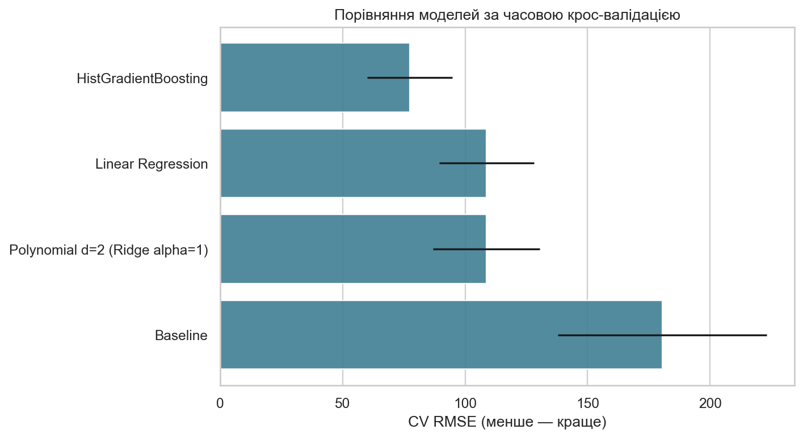
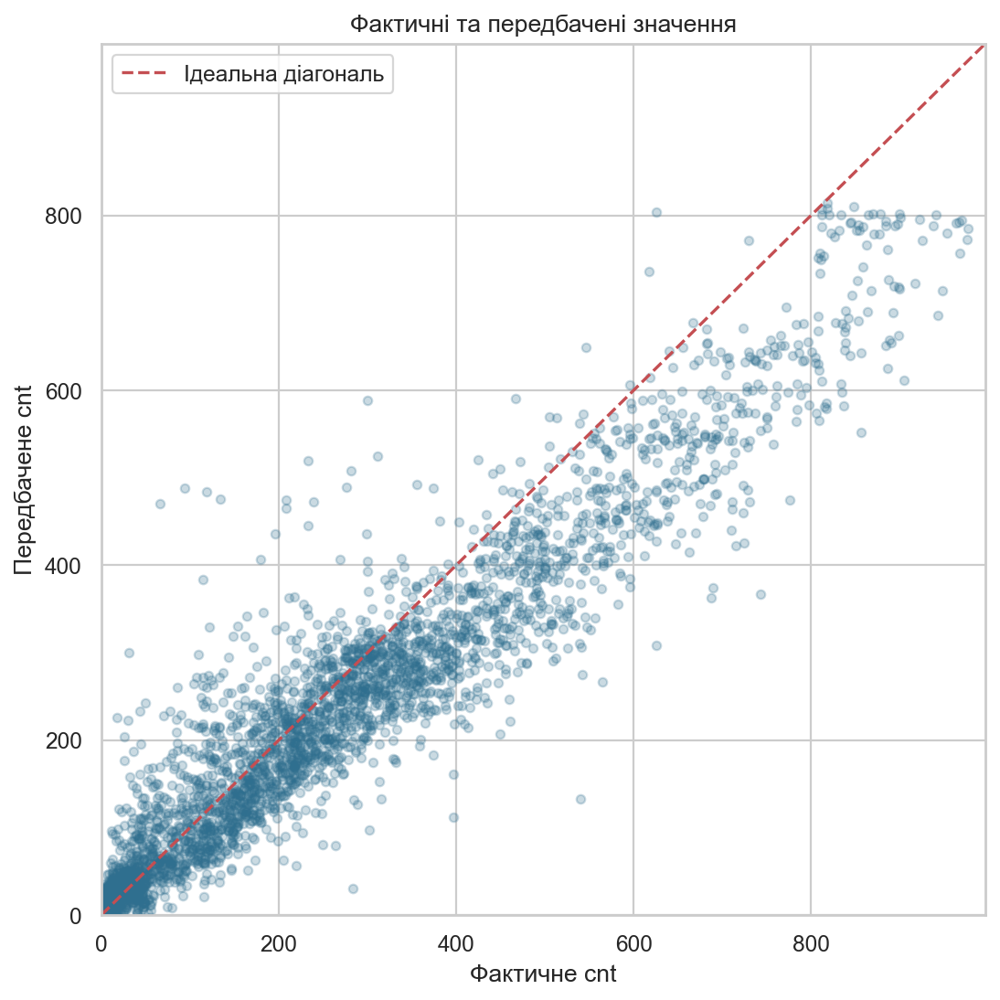
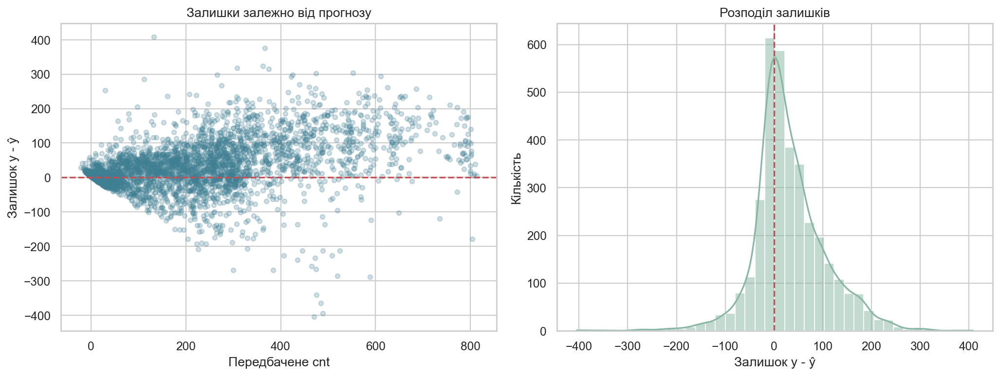

# Лабораторна робота №1

## Тема та мета

Побудова та дослідження регресійних моделей для прогнозування погодинної кількості оренд велосипедів. Мета — провести коректний експеримент без витоку даних, порівняти baseline і кандидатні моделі, вибрати модель за 5-fold часовою крос-валідацією та незалежно оцінити її на тестовому періоді.

## Прикладна задача

За календарними та погодними ознаками прогнозується `cnt` — кількість оренд протягом години. Результат може використовуватися для планування доступності велосипедів, персоналу й переміщення парку між станціями.

## План експерименту

1. Відсортувати спостереження за датою та годиною.
2. Відкласти останні 20% даних як тестовий період.
3. Виконувати імпутацію, масштабування та one-hot кодування всередині `Pipeline`.
4. Використати `TimeSeriesSplit(n_splits=5)` тільки на навчальній частині.
5. Порівняти `DummyRegressor`, лінійну регресію, поліноміальну регресію другого степеня з Ridge і `HistGradientBoostingRegressor`.
6. Вибрати модель за мінімальним середнім CV RMSE; стандартне відхилення показує стабільність.
7. Один раз оцінити обрану модель на тесті за MAE, RMSE і R².
8. Проаналізувати predicted-vs-actual, залишки та найбільші абсолютні похибки.

## Підбір параметрів

- Для поліноміальної Ridge перевірено `alpha ∈ {0.1, 1, 10, 100, 1000}`. Мінімальний CV RMSE отримано при `alpha=1`.
- Для HistGradientBoosting перевірено `max_leaf_nodes ∈ {15, 31, 63}` за однакових `learning_rate=0.08`, `max_iter=300`, `l2_regularization=1`. Обрано 15 листків.

## Результати

| Модель | CV RMSE | CV std | CV MAE | CV R² | Test RMSE | Test MAE | Test R² |
|---|---:|---:|---:|---:|---:|---:|---:|
| Baseline | 180,481 | 42,717 | 138,079 | -0,212 | 232,608 | 174,985 | -0,113 |
| Linear Regression | 108,762 | 19,356 | 80,494 | 0,545 | 133,835 | 98,798 | 0,632 |
| Polynomial d=2 + Ridge | 108,791 | 21,774 | 84,043 | 0,552 | 129,578 | 93,917 | 0,655 |
| **HistGradientBoosting** | **77,343** | **17,372** | **55,583** | **0,752** | **79,773** | **55,887** | **0,869** |

Усі три ML-моделі перевищили baseline. Збільшення формальної складності від лінійної до поліноміальної моделі майже не покращило CV RMSE. HistGradientBoosting дав найменшу середню похибку та найкращу стабільність серед кандидатів, тому його вибрано до перегляду тесту.

## Фінальне тестування й аналіз похибок

На відкладеному пізнішому періоді фінальна модель отримала `MAE=55,887`, `RMSE=79,773`, `R²=0,869`. Вона значно перевищує тестовий baseline, але RMSE вищий за MAE, що вказує на окремі великі помилки.

П’ять найбільших абсолютних похибок:

| Дата і година | Факт | Прогноз | Абсолютна похибка | Інтерпретація |
|---|---:|---:|---:|---|
| 2012-11-12 08:00 | 540 | 132,37 | 407,63 | нетипово високий ранковий попит за високої вологості |
| 2012-12-24 08:00 | 66 | 470,71 | 404,71 | святвечір не позначений як офіційне свято; звичайний ранковий патерн не діє |
| 2012-11-23 08:00 | 94 | 488,54 | 394,54 | день після Thanksgiving має аномально низький робочий попит |
| 2012-10-11 19:00 | 743 | 366,94 | 376,06 | нетипово високий вечірній попит |
| 2012-08-10 08:00 | 119 | 484,30 | 365,30 | сильний дощ і вологість різко знизили оренди |

Систематичний рисунок залишків частково зберігається в години пікового попиту. Найгірші випадки пов’язані зі святковими ефектами, рідкісною поведінкою та погодою, які наявні ознаки описують неповно.

## Обґрунтування вибору

HistGradientBoosting обрано не лише через найбільше R². Він має найкращий CV RMSE, нижчий розкид між fold, суттєво перевищує baseline, моделює нелінійність та взаємодії без неконтрольованого поліноміального розширення і зберігає добрий результат на хронологічному тесті. Обмеження — нижча інтерпретованість і чутливість до нетипових святкових або погодних годин.

## Висновки

1. Модель краща за baseline: тестовий RMSE зменшився з 232,608 до 79,773.
2. За крос-валідацією найкращою є HistGradientBoosting із 15 листками.
3. Ускладнення лінійної моделі поліномами другого степеня не дало переконливого CV-покращення.
4. На тесті отримано MAE 55,887, RMSE 79,773 та R² 0,869.
5. Основна маса похибок помірна, але є великі недооцінки й переоцінки пікових годин.
6. Найгірше модель працює для нетипових святкових днів, сильної негоди та аномального пікового попиту.
7. Дані охоплюють лише 2011–2012 роки, не мають подієвих і станційних ознак та містять дуже мало спостережень найгіршої погоди.
8. Рішення практично корисне для агрегованого погодинного планування, але не для точного керування окремими станціями.
9. Покращення можливе через ознаки спеціальних подій, лаги попиту, циклічне кодування часу, ширший часовий період і систематичніший пошук гіперпараметрів.

Повний код і результати містяться у [виконаному ноутбуці](notebook/lab01.ipynb).

