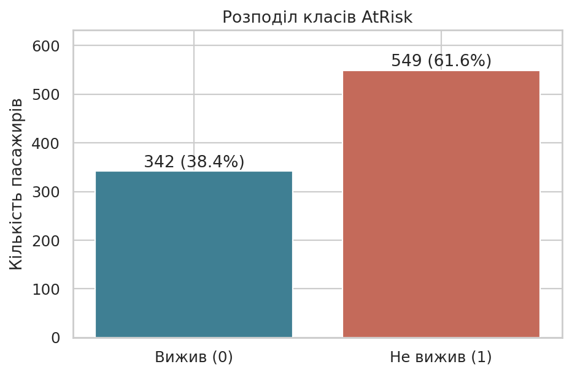
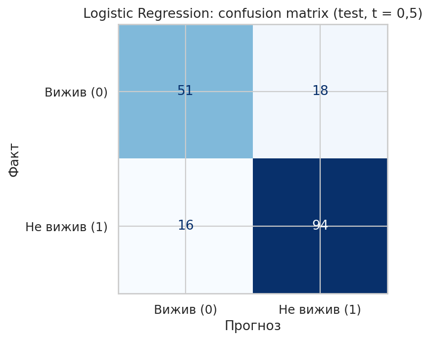
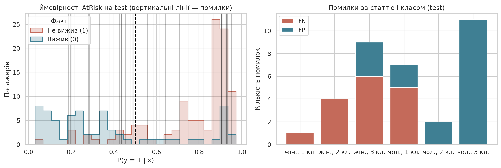
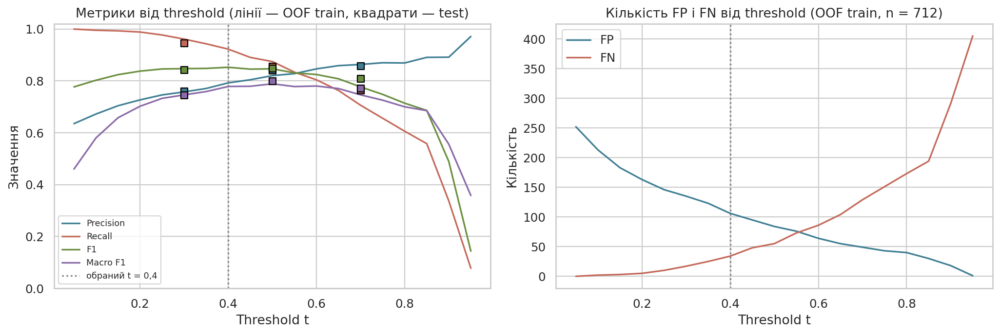
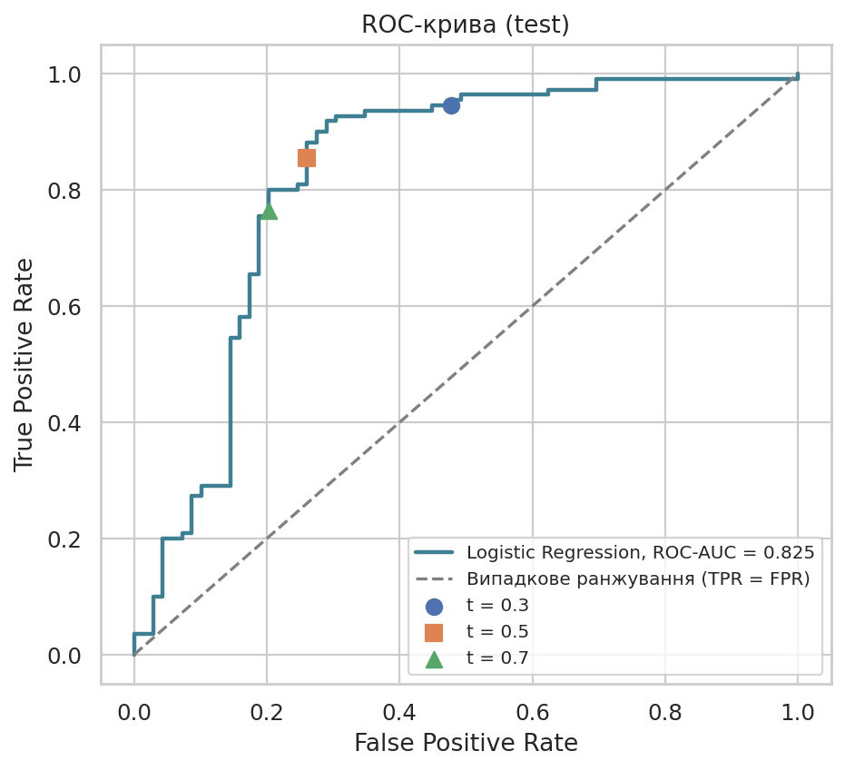

# Лабораторна робота №2

## Тема та мета

Класифікація та аналіз помилок моделі. Мета — побудувати й коректно оцінити бінарний класифікатор, проаналізувати confusion matrix, конкретні FP і FN, вплив порога класифікації та ROC-криву і зробити висновок про придатність моделі для прикладної задачі.

## Постановка задачі

Варіант 7 — **Titanic Dataset** (`data/titanic.csv`, Kaggle `train.csv`, 891 пасажир).

- **Об'єкт:** пасажир.
- **Ознаки:** `Pclass`, `Sex`, `Age`, `SibSp`, `Parch`, `Fare`, `Embarked`.
- **Ціль:** `Survived`. Прикладна постановка — оцінка ризику загибелі для пріоритезації допомоги під час евакуації, тому позитивний клас **`AtRisk = 1 − Survived`** (1 — не вижив). FN — пропущений пасажир із високим ризиком, FP — допомога тому, хто врятувався б сам; FN вважаються серйознішими.

## Опис даних

| Характеристика | Значення |
|---|---|
| Об'єкти / стовпці | 891 / 12 (+ `AtRisk`) |
| Частки класів | не вижив 61,6%, вижив 38,4% |
| Пропуски | `Age` 177 (19,9%), `Cabin` 687 (77,1%), `Embarked` 2 |
| Повні дублікати | 0; 127 рядків повторюють вектор 7 ознак, 16 таких груп мають різні мітки |
| Не використані | `PassengerId`, `Name`, `Ticket` (ідентифікатори), `Cabin` (77% пропусків) |

Дисбаланс помірний, але **позитивний клас — більшість**, тому baseline «усі не виживуть» має Recall 1 і F1 0,763. Тому додатково рахується macro F1.

## План експерименту

- Стратифікований split 80/20, `random_state=42`: train 712, test 179 (частка класу 1: 0,617 / 0,615). Цей самий поділ використовується в ЛР3, ПР4, ЛР4.
- Preprocessing у `Pipeline` (`src/titanic_workflow.py`): числові — медіана з індикатором пропуску + `StandardScaler`; `Pclass`, `Sex`, `Embarked` — мода + `OneHotEncoder`. Разом 13 ознак.
- Моделі: `DummyClassifier(most_frequent)`, `LogisticRegression`, `GaussianNB`.
- `StratifiedKFold(5, shuffle=True, random_state=42)`; метрики Accuracy, Precision, Recall, F1, macro F1, ROC-AUC.
- Вибір за CV; test використовується один раз; поріг вибирається за OOF-ймовірностями train.

## Реалізація

- `notebook/lab02.ipynb` — увесь експеримент.
- `../src/titanic_workflow.py` — завантаження, ціль `AtRisk`, спільний split, CV і preprocessing для ЛР2–ЛР4/ПР4.
- `results/` — CV, test-метрики, прогнози, таблиця помилок, пороги; `figures/` — рисунки.

## Результати cross-validation

| Модель | Accuracy | Precision | Recall | F1 | Macro F1 | ROC-AUC |
|---|---:|---:|---:|---:|---:|---:|
| Baseline | 0,617 | 0,617 | 1,000 | 0,763 | 0,381 | 0,500 |
| **Logistic Regression** | **0,805** | 0,821 | **0,875** | **0,847** | **0,789** | **0,854** |
| GaussianNB | 0,775 | 0,824 | 0,809 | 0,816 | 0,764 | 0,839 |

Std між fold-ами: macro F1 0,018 (LR) і 0,021 (NB); ROC-AUC 0,021 і 0,042. Обрано **Logistic Regression**: найкращі macro F1, F1, Recall і ROC-AUC, стабільні fold-и. GaussianNB трохи гірший: його припущення (незалежність, нормальність) порушені для one-hot та асиметричних `Fare`, `SibSp`, `Parch`.

## Результати на test

| Метрика | CV (LR) | Test (LR) | Test (baseline) |
|---|---:|---:|---:|
| Accuracy | 0,805 | 0,810 | 0,615 |
| Precision | 0,821 | 0,839 | 0,615 |
| Recall | 0,875 | 0,855 | 1,000 |
| F1 | 0,847 | 0,847 | 0,761 |
| Macro F1 | 0,789 | 0,798 | 0,381 |
| ROC-AUC | 0,854 | 0,825 | 0,500 |

TN = 51, FP = 18, FN = 16, TP = 94. Test узгоджується з CV; найбільше відхилення — ROC-AUC (−0,03 ≈ 1,5 std), звичайне для 179 об'єктів.

Коефіцієнти LR (лог-шанси загибелі): `Sex_male` +1,26, `Pclass_3` +1,20, `Age` +0,56, `SibSp` +0,34; `Sex_female` −1,38, `Pclass_1` −1,15.

## Аналіз помилок

34 помилки (18 FP, 16 FN): 10 біля порога (|p − 0,5| < 0,1), 15 впевнених (|p − 0,5| > 0,3). Повна таблиця — `results/misclassified.csv`.

| Стать, клас | n | Фактичний ризик | Середня p | FP | FN |
|---|---:|---:|---:|---:|---:|
| жін., 1 | 15 | 0,07 | 0,08 | 0 | 1 |
| жін., 2 | 20 | 0,20 | 0,19 | 0 | 4 |
| жін., 3 | 31 | 0,39 | 0,44 | 3 | 6 |
| чол., 1 | 20 | 0,65 | 0,51 | 2 | 5 |
| чол., 2 | 18 | 0,89 | 0,75 | 2 | 0 |
| чол., 3 | 75 | 0,85 | 0,91 | 11 | 0 |

- **FP** — переважно чоловіки 3-го класу, які вижили (11 з 18), з p ≈ 0,87–0,95; серед них троє хлопчиків (`Master`).
- **FN** — переважно жінки, що загинули (11 з 16); найвпевненіша помилка — дворічна дівчинка 1-го класу (p = 0,032).
- **Чоловіки 1-го класу** — 5 FN біля порога: фактичний ризик 0,65, а модель у середньому дає 0,51.

Гіпотези: (1) ефект класу різний для статей, а LR без взаємодій цього не бачить — перевірити `Sex × Pclass` або дерево (ЛР4); (2) бракує ознаки «дитина/титул» з `Name`; (3) частина помилок неусувна — 16 груп однакових ознак мають різні мітки.

## Вплив порога

| Threshold | Precision | Recall | F1 | FP | FN |
|---:|---:|---:|---:|---:|---:|
| 0,3 | 0,759 | 0,945 | 0,842 | 33 | 6 |
| 0,5 | 0,839 | 0,855 | 0,847 | 18 | 16 |
| 0,7 | 0,857 | 0,764 | 0,808 | 14 | 26 |

Поріг обирався за OOF-ймовірностями train, а не за test. **Пропонований поріг t = 0,4:** на OOF F1 максимальний (0,853), FN зменшуються з 55 до 34 ціною +22 FP, macro F1 падає лише з 0,789 до 0,779. Зниження до 0,3 дає ще −17 FN, але +29 FP.

## ROC-крива

ROC-AUC = 0,825: приблизно у 82% пар «загинув / вижив» модель дає вищий ризик першому. Зміна порога лише пересуває робочу точку по цій кривій.

## Висновки

1. Baseline: Accuracy 0,617, F1 0,763, але macro F1 0,381 і ROC-AUC 0,5 — без жодної здатності розрізняти класи.
2. LR: CV macro F1 0,789, ROC-AUC 0,854; GaussianNB: 0,764 і 0,839. Обрано LR як кращу й стабільнішу.
3. Test (t = 0,5): Accuracy 0,810, Precision 0,839, Recall 0,855, F1 0,847, macro F1 0,798, ROC-AUC 0,825.
4. 18 FP і 16 FN; критичніші FN (пропущений пасажир із високим ризиком).
5. Помилки систематичні: впевнені FP серед чоловіків 3-го класу, FN серед жінок 2–3 класу та біля порога серед чоловіків 1-го класу.
6. Зменшення порога підвищує Recall і зменшує FN за рахунок FP; доцільний поріг — 0,4.
7. Обмеження: лінійна межа без взаємодій, мало ознак (немає титулу, каюти), невеликий test (179), історичні дані без реального прикладного застосування.
