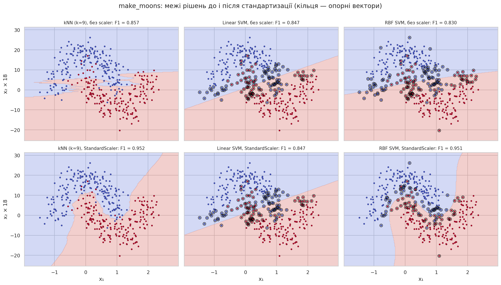
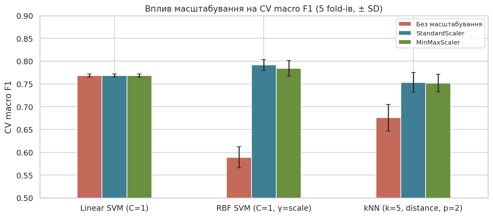
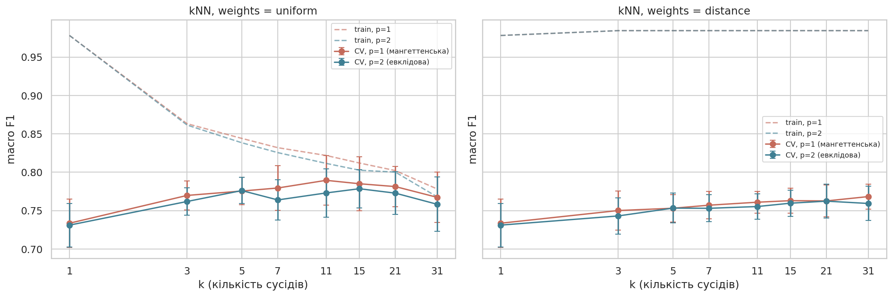
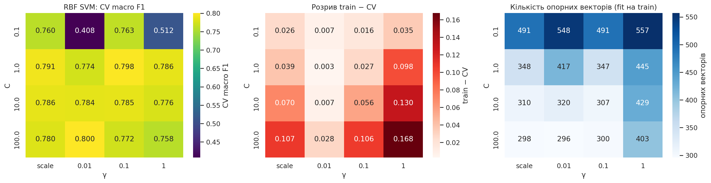
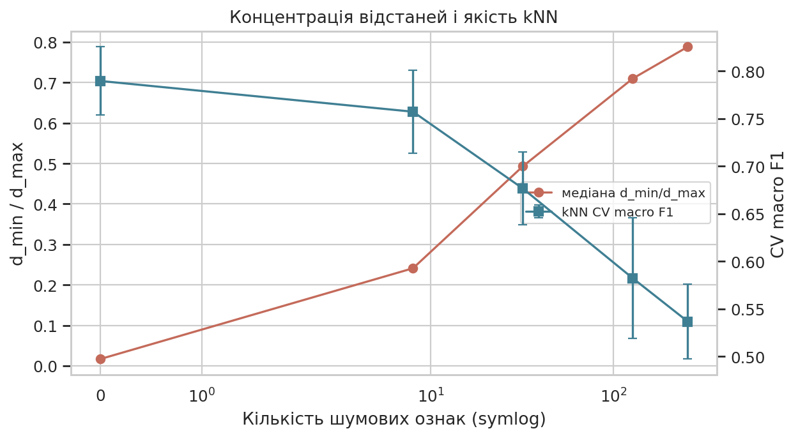
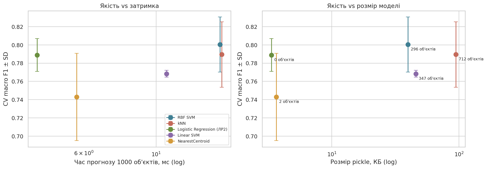
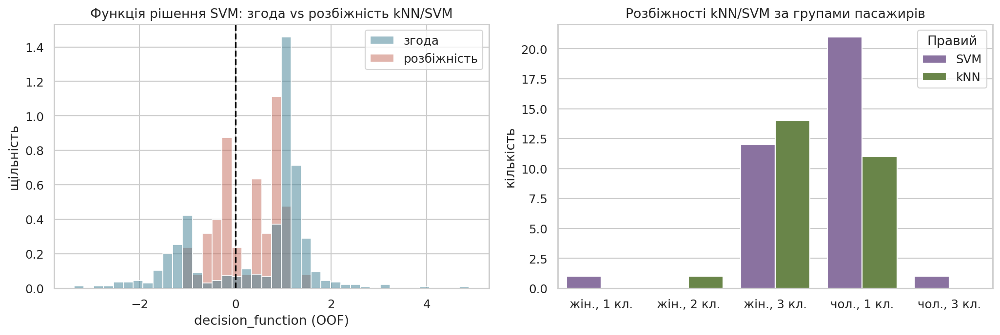

# Лабораторна робота №3

## Тема та мета

Порівняння метричних методів і машин опорних векторів. Мета — дослідити класифікацію на основі відстані та розділювальної межі, експериментально визначити вплив метрики, масштабування, `k`, ядра, `C` і `γ` на якість та обчислювальні характеристики, і обґрунтовано вибрати алгоритм для інженерної задачі.

## Постановка задачі

Індивідуальний набір — **Titanic** з ЛР2 (891 пасажир, 7 ознак, ціль `AtRisk = 1 − Survived`), той самий стратифікований split 80/20 (`random_state=42`, train 712 / test 179; перевірено збіг test з ЛР2). Прикладна мета — оцінка ризику загибелі для пріоритезації допомоги; важливі обидва класи, тому **основна метрика — macro F1** (F1 позитивного класу-більшості завищує тривіальний baseline до 0,76, див. ЛР2). Додатково: Accuracy, F1 класу 1, ROC-AUC.

**Інженерні критерії:** затримка прогнозу, розмір моделі, можливість пояснити рішення, вартість оновлення при нових даних.

### Гіпотези

| Гіпотеза | Експеримент | Критерій | Результат |
|---|---|---|---|
| H1. Без масштабування kNN і RBF SVM погіршаться (`Fare` 0–512 домінує) | фіксовані моделі × {none, Standard, MinMax} | падіння macro F1 ≥ 0,02 | **підтверджено**: kNN −0,077, RBF −0,202; linear SVM — без змін |
| H2. Для kNN потрібне `k` > 1 і зважування за відстанню | сітка `k × p × weights` | найкраще `k` ≥ 5, `k=1` гірше на ≥ 0,02 | **частково**: `k=11` (+0,055 до `k=1`), але **uniform** кращий за distance |
| H3. RBF SVM краща за linear SVM | linear `C` vs `C × γ` | різниця > 1 std | **ледь підтверджено**: 0,800 vs 0,768 (Δ 0,032 при SD RBF 0,030) |
| H4. Шумові ознаки зменшать контраст відстаней і якість kNN | 0…256 шумових ознак | `d_min/d_max` ↑, F1 ↓ | **підтверджено**: 0,017 → 0,788; 0,789 → 0,537 |

## План експерименту

| Елемент | Значення |
|---|---|
| CV | `StratifiedKFold(5, shuffle=True, random_state=42)` — однакові fold-и всюди |
| Preprocessing | `Pipeline`: числові (`Age`, `SibSp`, `Parch`, `Fare` + індикатор пропуску `Age`) — медіана → scaler; `Pclass`, `Sex`, `Embarked` — мода → one-hot (без масштабування) |
| Масштабування | passthrough / `StandardScaler` / `MinMaxScaler` |
| kNN | `k ∈ {1,3,5,7,11,15,21,31}` × `p ∈ {1,2}` × `weights` — 32 конфігурації |
| Linear SVM | `C ∈ {0.01, 0.1, 1, 10, 100}` — 5 |
| RBF SVM | `C ∈ {0.1, 1, 10, 100}` × `γ ∈ {scale, 0.01, 0.1, 1}` — 16 |
| NearestCentroid | 1 |
| Правило вибору | найбільший CV macro F1; якщо кандидати в межах 1 SD лідера — менша модель (розмір/затримка) |
| Test | відкривається один раз |

## Реалізація

- `notebook/lab03.ipynb` — усі експерименти.
- `../src/titanic_workflow.py` — дані, split, CV, preprocessing із параметром `scale`.
- `results/` — повні таблиці пошуку (`knn_grid.csv`, `svm_grid.csv`), масштабування, розмірності, порівняння, OOF-прогнози (`oof_predictions.csv`), розбіжності, test.

## Контрольний геометричний експеримент (`make_moons`)

520 точок, шум 0,22, друга ознака × 18; однаковий split для всіх варіантів.

| Модель | Без scaler | StandardScaler |
|---|---:|---:|
| kNN (k=9) | 0,857 | 0,952 |
| Linear SVM | 0,847 | 0,847 |
| RBF SVM | 0,830 | 0,951 |

Без масштабування відстань визначає майже лише `x₂`: межа kNN стає «смугастою» горизонтальною, а RBF-ядро бачить майже одновимірні дані. Після стандартизації обидві моделі відтворюють форму «місяців». Linear SVM однаковий в обох випадках: її обмеження — **форма межі** (пряма), а не масштаб. Так розділяються дві причини помилок: спотворена геометрія і недостатня форма моделі.

## Дані Titanic: зміст відстані

Сирі діапазони: `Age` 0,42–80, `SibSp` 0–8, `Parch` 0–6, `Fare` 0–512 (std 50,6). One-hot категорії не масштабуються: зміна статі чи класу дає внесок 2 у квадрат евклідової (і 2 у мангеттенську) відстань. Без масштабування різниця у `Fare` на десятки фунтів повністю перекриває стать — найсильнішу ознаку. Тому scaler фактично задає **відносну вагу числових і категоріальних ознак** у метриці.

## Дослідження масштабування

| Модель (фіксовані параметри) | Без масштабування | StandardScaler | MinMaxScaler |
|---|---:|---:|---:|
| kNN (k=5, distance, p=2) | 0,676 ± 0,029 | **0,753** ± 0,022 | 0,752 ± 0,019 |
| Linear SVM (C=1) | 0,768 ± 0,004 | 0,768 ± 0,004 | 0,768 ± 0,004 |
| RBF SVM (C=1, γ=scale) | 0,589 ± 0,023 | **0,791** ± 0,012 | 0,784 ± 0,017 |

kNN і RBF SVM без scaler сильно погіршуються (`Fare` домінує у відстані/ядрі). `StandardScaler` і `MinMaxScaler` дають близький результат; обрано `StandardScaler` для обох сімейств (трохи краще для RBF). Linear SVM нечутлива до масштабу за якістю, але без масштабування навчається у ~100 разів довше (2 с проти 0,02 с) — погана обумовленість задачі оптимізації.

## Метричні класифікатори

- **NearestCentroid**: 0,743 ± 0,048 — один центроїд на клас погано описує клас «вижив», до якого входять дуже різні групи (жінки всіх класів і діти).
- **kNN**: найкраща конфігурація `k=11`, `p=1` (мангеттенська), `weights="uniform"` — **0,789 ± 0,036**.

| k | p | weights | CV macro F1 | Train macro F1 |
|---:|---:|---|---:|---:|
| 11 | 1 | uniform | **0,789** | 0,822 |
| 15 | 1 | uniform | 0,785 | 0,812 |
| 21 | 1 | uniform | 0,781 | 0,802 |
| 7 | 1 | uniform | 0,779 | 0,832 |
| 3 | 1 | distance | 0,750 | 0,984 |
| 1 | 1 | — | 0,734 | 0,978 |

- Малі `k` перенавчаються (train 0,98, CV 0,73); з ростом `k` межа згладжується, оптимум — `k = 11`, далі якість повільно падає.
- **Зважене голосування гірше** (максимум 0,768 проти 0,789). Причина — 127 пасажирів мають повністю однаковий вектор ознак з іншими: сусід на відстані 0 отримує нескінченну вагу, і зважений kNN фактично перетворюється на `k=1` (train ≈ 0,98).
- Мангеттенська метрика трохи краща за евклідову (0,789 проти 0,779): за L1 одна велика різниця (наприклад, у `Fare`) менше домінує над сумою інших.

## Машини опорних векторів

| Модель | Найкращі параметри | CV macro F1 | Опорних векторів |
|---|---|---:|---:|
| Linear SVM | C = 0,1 | 0,768 ± 0,003 | 347 |
| RBF SVM | C = 100, γ = 0,01 | **0,800 ± 0,027** | 296 |
| RBF SVM (найстабільніша) | C = 1, γ = 0,1 | 0,798 ± 0,008 | 347 |

- **Linear SVM** дає 0,768 для будь-якого `C` від 0,1 до 100: її OOF-прогнози **на 100% збігаються з правилом «чоловік → не вижив»** (macro F1 правила = 0,768). Лінійна межа з hinge-loss «вибирає» найсильнішу ознаку і нічого більше.
- **RBF SVM**: хороша область — діагональ, де `C · γ` ≈ 0,1–1. За малого `C` і малого `γ` (C=0,1, γ=0,01) модель вироджується у прогноз класу-більшості (0,408). За `γ = 1` вплив кожного об'єкта стає локальним: train зростає до 0,93, CV падає до 0,76 — перенавчання. `γ = scale` ≈ 0,137.
- Найкраща конфігурація (C=100, γ=0,01) лежить на межі сітки за `C`, але сусідня C=1, γ=0,1 майже така сама (0,798) і має утричі менший розкид, тобто існує широка область рівноцінних рішень — розширювати сітку немає сенсу.

## Контрольований експеримент із розмірністю

| Шумових ознак | Усього ознак | Медіана d_min/d_max | kNN CV macro F1 |
|---:|---:|---:|---:|
| 0 | 13 | 0,017 | 0,789 ± 0,036 |
| 8 | 21 | 0,241 | 0,757 ± 0,043 |
| 32 | 45 | 0,493 | 0,676 ± 0,038 |
| 128 | 141 | 0,710 | 0,582 ± 0,063 |
| 256 | 269 | 0,788 | 0,537 ± 0,039 |

Шумові ознаки `U(0,1)` проходять той самий scaler, що й справжні, тож проблема не в одиницях. Уже 8 шумових ознак погіршують kNN, а 256 зводять його майже до випадкового (macro F1 0,54): найближчий і найдальший сусіди стають майже однаково віддаленими. Штучні ознаки після досліду відкинуто.

## Порівняння моделей

| Модель | Параметри | CV macro F1 | SD | ROC-AUC | Fit, мс | Predict 1000, мс | Розмір, КБ | Збережено об'єктів |
|---|---|---:|---:|---:|---:|---:|---:|---:|
| **RBF SVM** | C=100, γ=0,01 | **0,800** | 0,030 | 0,847 | 25,3 | 15,7 | 39,6 | 296 SV |
| kNN | k=11, p=1, uniform | 0,789 | 0,036 | 0,854 | 9,4 | 15,9 | 94,4 | 712 |
| Logistic Regression (ЛР2) | C=1 | 0,789 | 0,018 | 0,854 | 12,4 | 4,3 | 3,4 | — |
| Linear SVM | C=0,1 | 0,768 | 0,004 | 0,825 | 15,8 | 10,8 | 45,8 | 347 SV |
| NearestCentroid | StandardScaler | 0,743 | 0,048 | 0,844 | 10,5 | 5,7 | 3,7 | 2 |

Час виміряно в одному середовищі (медіана кількох запусків після прогріву) і придатний лише для відносного порівняння.

RBF SVM і kNN різняться менше ніж на 1 SD — безумовного переможця за якістю немає. RBF SVM удвічі менша за kNN (зберігає 296 опорних векторів замість усіх 712 пасажирів). Логістична регресія з ЛР2 має таку саму якість, як kNN, але у 12–28 разів менша й приблизно в 3,5–3,7 раза швидша.

## Аналіз розбіжностей kNN і RBF SVM (OOF)

OOF macro F1: kNN 0,789, RBF SVM 0,801. Розбіжностей — **61 з 712**: правий kNN — 26, правий SVM — 35; ще 102 пасажири — спільні помилки обох моделей. Розбіжності майже повністю зосереджені у двох групах: **жінки 3-го класу** (26: kNN правий у 14, SVM — у 12) і **чоловіки 1-го класу** (32: SVM правий у 21, kNN — у 11). Повна таблиця — `results/disagreements.csv`, нижче 12 характерних випадків.

| PassengerId | Факт | kNN | SVM | Правий | SVM decision | Сусіди «не вижив» | Відстані сусідів | Пасажир |
|---:|---:|---:|---:|---|---:|---|---|---|
| 371 | 0 | 0 | 1 | kNN | +0,02 | 3/11 | 0,80 … 2,59 | чол., 1 кл., 25 р., Fare 55 |
| 504 | 1 | 1 | 0 | kNN | −0,08 | 6/11 | 0,48 … 1,12 | жін., 3 кл., 37 р. |
| 475 | 1 | 1 | 0 | kNN | −0,09 | 6/11 | 0,05 … 0,66 | жін., 3 кл., 22 р. |
| 643 | 1 | 1 | 0 | kNN | −0,12 | 6/11 | 0,52 … 3,98 | дівчинка 2 р., 3 кл., велика родина |
| 294 | 1 | 1 | 0 | kNN | −0,17 | 6/11 | 0,09 … 0,47 | жін., 3 кл., 24 р. |
| 535 | 1 | 1 | 0 | kNN | −0,24 | 6/11 | 0,07 … 0,62 | жін., 3 кл., 30 р. |
| 558 | 1 | 0 | 1 | SVM | +1,40 | 3/11 | **3,76 … 5,85** | чол., 1 кл., Fare 227,5, вік невідомий |
| 12 | 0 | 1 | 0 | SVM | −1,07 | 6/11 | 0,71 … 2,54 | жін., 1 кл., 58 р. |
| 537 | 1 | 0 | 1 | SVM | +1,02 | 5/11 | 0,00 … 0,82 | чол., 1 кл., 45 р. |
| 663 | 1 | 0 | 1 | SVM | +1,01 | 5/11 | 0,17 … 1,02 | чол., 1 кл., 47 р. |
| 516 | 1 | 0 | 1 | SVM | +1,01 | 5/11 | 0,29 … 1,07 | чол., 1 кл., 47 р. |
| 368 | 0 | 1 | 0 | SVM | −1,00 | 7/11 | 0,00, 1,02, **2,00 ×9** | жін., 3 кл., Embarked C, вік невідомий |

Розбіжності зосереджені поблизу межі SVM (|decision| ≲ 1), тоді як при згоді моделей функція рішення зазвичай далека від нуля.

**Гіпотези про причини:**

1. *Локальна частота проти гладкої межі (жінки 3-го класу).* Тут фактичний ризик ≈ 50%, сусіди дуже близькі (відстані 0,05–0,6) і голосують 6/11. kNN відтворює локальну частоту, а SVM з гладкою межею розміщує цю групу трохи «по безпечний бік» (decision ≈ −0,1…−0,2). kNN правий у таких випадках частіше.
2. *Розріджені області та «перетікання» між категоріями.* Для пасажира 558 (1 клас, Fare 227,5) найближчий сусід віддалений на 3,8 — локальної інформації немає, і голоси випадкові; глобальна межа SVM надійніша. Для пасажира 368 дев'ять із 11 сусідів лежать на відстані рівно 2,00 — це пасажири з **іншою категорією** (інший порт або клас): за L1 зміна однієї one-hot категорії «коштує» як 2 стандартні відхилення віку. Отже, сусідство kNN частково ігнорує межі категорій.
3. *Чоловіки 1-го класу:* 11 сусідів голосують 5/11 — kNN «ледь» віддає перевагу виживанню, тоді як SVM використовує сукупний ефект віку (45–47 р.) і класу. Тут SVM правий у 21 з 32 випадків.

## Вибір фінальної моделі

Лідер за CV — RBF SVM (0,800 ± 0,030); kNN (0,789) у межах 1 SD. За заздалегідь заданим правилом серед рівноцінних обрано меншу модель — **RBF SVM (C=100, γ=0,01, StandardScaler)**: удвічі менший розмір, ширший запас за розбіжностями (правий у 35 з 61), без зберігання всієї навчальної вибірки. Невизначеність прямо зазначено: перевага над kNN статистично не доведена.

## Фінальне оцінювання (test, один раз)

| Accuracy | Precision | Recall | F1 (клас 1) | Macro F1 | ROC-AUC | TN | FP | FN | TP |
|---:|---:|---:|---:|---:|---:|---:|---:|---:|---:|
| 0,827 | 0,816 | 0,927 | 0,868 | **0,808** | 0,820 | 46 | 23 | 8 | 102 |

Test macro F1 0,808 узгоджується з CV 0,800 ± 0,030. Порівняно з LR із ЛР2 (test macro F1 0,798) RBF SVM має вищий Recall (0,927 проти 0,855, FN 8 проти 16), але більше FP (23 проти 18). Test в інших фрагментах notebook не використовувався, модель після нього не змінювалась. Обмеження: той самий test уже бачила ЛР2.

## Інженерні сценарії

1. **Малий набір і пояснення через подібні об'єкти** — **kNN (k=11, L1)**: якість у межах 1 SD від лідера, а прогноз пояснюється 11 конкретними пасажирами з їхніми долями й відстанями; нові дані додаються без перенавчання.
2. **Багато запитів і жорстка затримка** — **логістична регресія (ЛР2)**: та сама якість, що й kNN, прогноз у 3–4 рази швидший за SVM/kNN, модель 3,4 КБ; якщо дозволено лише сімейства ЛР3 — linear SVM (10,8 мс) ціною −0,03 macro F1, або RBF SVM, якщо ≈ 16 мс на 1000 об'єктів прийнятні.

## Аудит рекомендацій ШІ

| Твердження ШІ | Спосіб перевірки | Фактичний результат | Вердикт |
|---|---|---|---|
| «Для kNN і SVM завжди застосовуйте StandardScaler» | фіксовані моделі, змінюється лише scaler | для kNN/RBF суттєво потрібен, але MinMax рівноцінний; для linear SVM якість не змінюється | **змінено**: потрібне масштабування, не обов'язково саме Standard |
| «Зважений kNN (`weights="distance"`) кращий» | однакові fold-и, решта параметрів однакові | 0,768 проти 0,789; через дублікати (d=0) зважений kNN ≈ 1-NN | **відхилено** |
| «RBF-ядро значно краще за лінійне» | linear `C` vs `C × γ` на тих самих fold-ах | +0,032 ≈ 1 SD; linear SVM = правило статі | **змінено**: перевага є, але невелика |
| «RBF SVM — найкраща модель для системи» | порівняння з kNN і LR за якістю, часом, розміром | різниця з kNN < 1 SD, LR рівна за якістю й набагато дешевша | **змінено**: вибір залежить від сценарію |

## Висновки

1. Масштабування критичне для kNN (+0,077) і RBF SVM (+0,202), не впливає на якість linear SVM, але прискорює її навчання ~100×. Standard і MinMax рівноцінні.
2. Доцільна метрика — мангеттенська (`p=1`); вона менше піддається домінуванню однієї ознаки.
3. `k` = 1 перенавчається (train 0,98, CV 0,73), оптимум `k = 11`, далі межа надмірно згладжується; зважене голосування гірше через дублікати векторів.
4. RBF-ядро краще за лінійне (0,800 проти 0,768), бо лінійна SVM вироджується у правило статі.
5. `C` і `γ` взаємодіють: хороша область — діагональ `C·γ ≈ 0,1–1`; малі обидва → прогноз більшості, великий `γ` → перенавчання.
6. 256 шумових ознак підняли `d_min/d_max` з 0,017 до 0,788 і знизили kNN з 0,789 до 0,537.
7. Розбіжності kNN/SVM (61 з 712) — у жінок 3-го класу (локальна частота, kNN) і чоловіків 1-го класу (глобальна межа, SVM).
8. Найкращий компроміс за правилом протоколу — RBF SVM; test macro F1 0,808, Recall 0,927.
9. Обмеження: малий набір (712 у train), повторне використання test, вимір часу в одному середовищі, лише 7 ознак.
10. Гіпотези H1 і H4 підтверджено, H3 — ледь, H2 — частково (потрібне `k > 1`, але не зважування).
