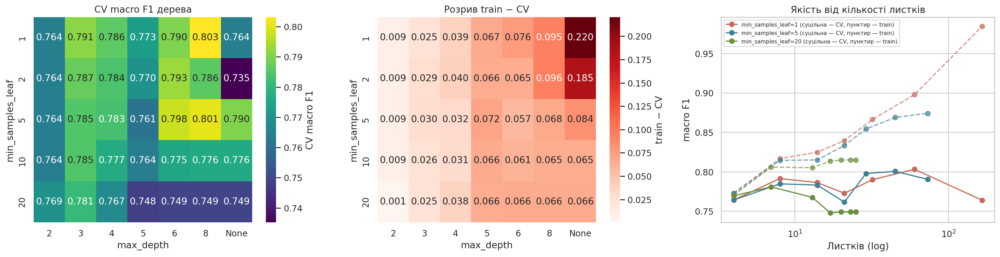
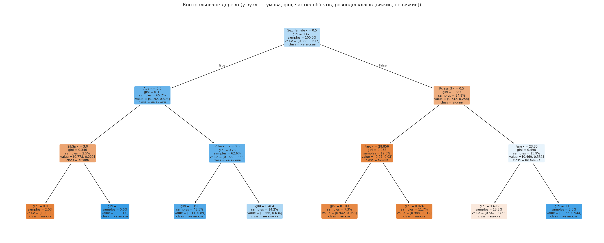
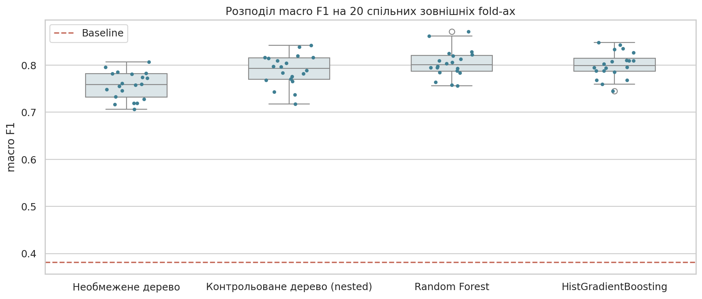
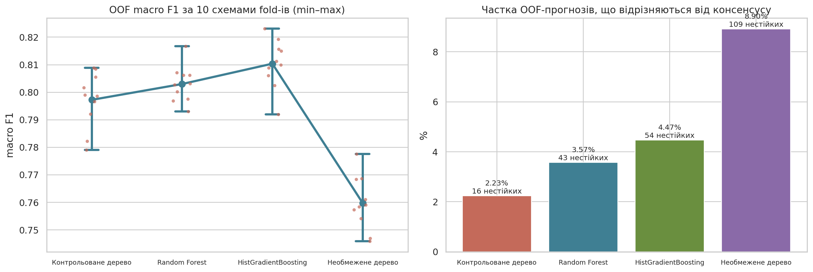
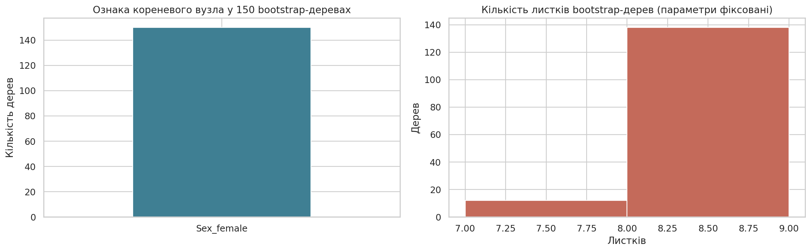
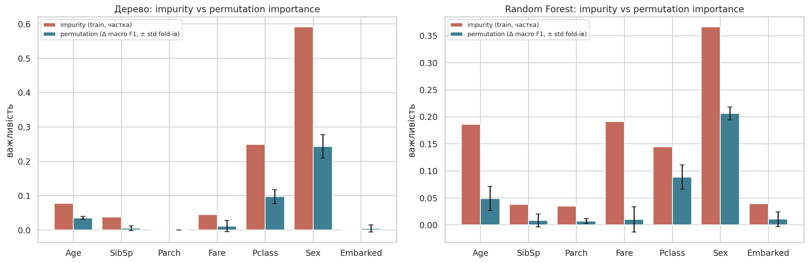
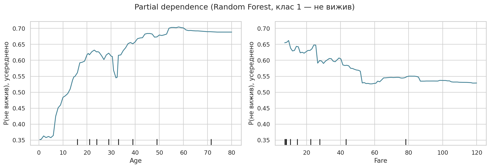
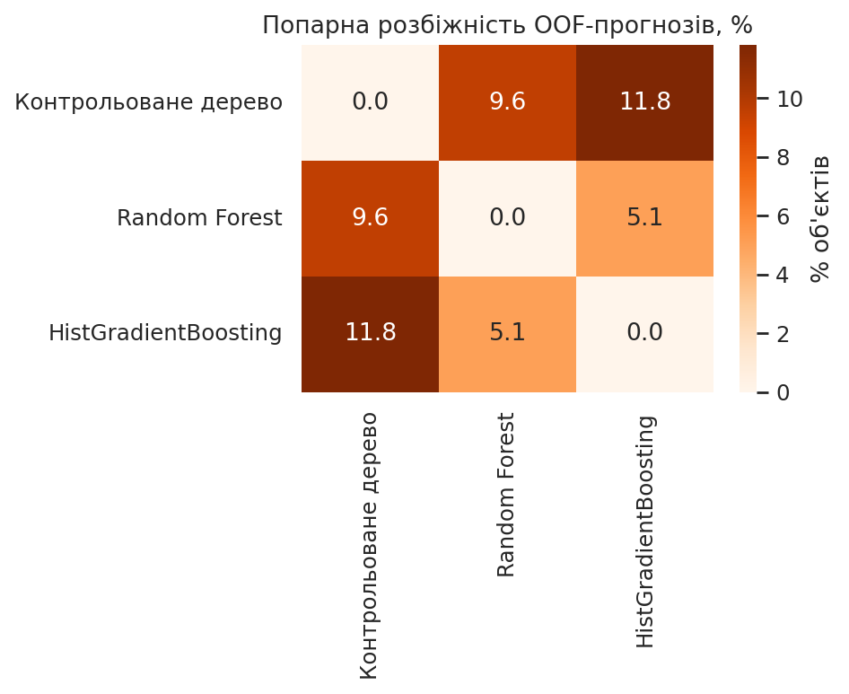
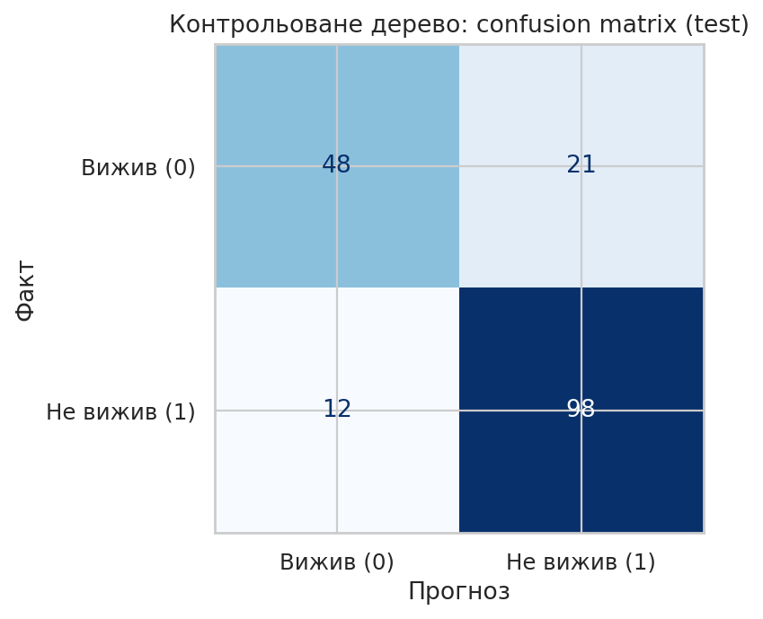

# Лабораторна робота №4

## Тема та мета

Дерева рішень та ансамблі: якість, стійкість та інтерпретація. Мета — побудувати дерево рішень і ансамблі, дослідити зв'язок структури дерева з узагальненням, порівняти дерево, випадковий ліс і градієнтний boosting за однаковою схемою, оцінити стійкість метрик, прогнозів і структури, порівняти способи визначення важливості ознак і обґрунтувати вибір моделі з урахуванням якості, витрат та пояснюваності.

## Постановка задачі

Повторно використано набір ЛР2 — **Titanic** (891 пасажир, 7 змістовних ознак, ціль `AtRisk = 1 − Survived`), але з новим питанням: **чи виправданий перехід від окремого дерева до ансамблю з урахуванням якості, стійкості та можливості пояснення?** Набір задовольняє вимоги методички (891 ≥ 300 об'єктів, 7 ≥ 6 ознак), але невеликий, тому особливу увагу приділено невизначеності.

### Гіпотези

| № | Гіпотеза | Показник | Правило | Результат |
|---|---|---|---|---|
| H1 | Ансамбль дасть вищий macro F1, ніж контрольоване дерево | CV на 20 спільних fold-ах | різниця > SD дерева | **не підтверджено**: +0,014 (RF), +0,011 (HGB) при SD 0,033 |
| H2 | Прогнози RF менш чутливі до зміни fold-ів | розбіжність з консенсусом за 10 seed-ами | у RF менше вдвічі | **спростовано** для контрольованого дерева (2,23% проти 3,57%); **підтверджено** для необмеженого (8,90%) |
| H3 | Обмеження глибини зменшить розрив train − CV | gap для сітки | gap росте з глибиною | **підтверджено**: 0,020 (глибина 3) → 0,228 (без межі) |
| H4 | Ранг важливості змінюється між fold-ами | PI по fold-ах, частота top-3 | ознака з top-3 < 100% fold-ів | **підтверджено для дерева** (`Age` 80%, `Fare` 20%); у RF top-3 стабільний |

## Протокол (зафіксований до навчання)

| Елемент | Значення |
|---|---|
| Дані | `data/titanic.csv`, ознаки `Age, SibSp, Parch, Fare, Pclass, Sex, Embarked` |
| Метрика | **macro F1** (позитивний клас — більшість, F1 класу 1 завищує baseline); додатково Accuracy |
| Split | стратифікований 80/20, `random_state=42` (712 / 179); id збережено в `results/split_ids.csv` |
| Зовнішня CV | `RepeatedStratifiedKFold(5 × 4)` = 20 спільних fold-ів |
| Дерево | nested CV: внутрішній `StratifiedKFold(4)` обирає `max_depth ∈ {2,3,4,5,6,8,None}` × `min_samples_leaf ∈ {1,2,5,10,20}` |
| RF | 300 дерев, `max_features="sqrt"`, `min_samples_leaf=2` |
| HGB | 200 ітерацій, `learning_rate=0.05`, `max_leaf_nodes=15`, `l2_regularization=1.0`, без early stopping |
| Preprocessing | медіана + індикатор пропуску; мода + one-hot; **без масштабування** (розбиття залежить лише від порядку значень) |
| Правило вибору | ансамбль — лише якщо його CV вищий за дерево більш ніж на SD дерева **і** прогнози стабільніші; інакше — контрольоване дерево |

**Задокументована зміна.** Перший запуск обирав структуру дерева за простим максимумом CV і дав `max_depth=8, min_samples_leaf=1` — 60 листків, 0,803 ± 0,041. Таке дерево не читається, а його перевага над глибиною 3 (0,791) менша за SE. Тому, як у ПР3, структуру обрано **правилом однієї SE** (найменша глибина, потім найбільший `min_samples_leaf` серед конфігурацій із CV ≥ 0,785). Зміну внесено до відкриття test, ансамблі не змінювались. Конфігурацію збережено в `configs/final_model.json`.

## Реалізація

- `notebook/lab04.ipynb` — експеримент.
- `configs/final_model.json` — фінальна модель, параметри, правило вибору й докази.
- `results/` — сітка структури, fold-оцінки, стійкість за seed-ами і по об'єктах, bootstrap-структура, permutation importance по fold-ах, OOF-розбіжності, інженерні характеристики, test.

## Дані

891 пасажир (342 вижили — 38,4%, 549 — ні), 7 ознак, пропуски: `Age` 177, `Embarked` 2; повних дублікатів і константних ознак немає. Ризики витоку: `Survived` вилучено, ідентифікатори (`PassengerId`, `Name`, `Ticket`) і `Cabin` не використовуються; максимальна |кореляція| числової ознаки з ціллю — 0,338.

## Окреме дерево

| max_depth | min_samples_leaf | Train | CV | CV std | Gap | Листків |
|---|---:|---:|---:|---:|---:|---:|
| 8 | 1 | 0,898 | **0,803** | 0,041 | 0,095 | 60 |
| 8 | 5 | 0,869 | 0,801 | 0,016 | 0,068 | 45 |
| 6 | 5 | 0,854 | 0,798 | 0,014 | 0,057 | 29 |
| 3 | 1 | 0,817 | 0,791 | 0,021 | 0,025 | 8 |
| **3** | **2** | 0,816 | 0,787 | 0,018 | 0,029 | **8** |
| None | 1 | 0,984 | 0,764 | — | 0,220 | 165 |



Необмежене дерево (глибина 21, 165 листків) майже ідеально відтворює train (0,984), але має найгірший CV. Зі зростанням глибини розрив train − CV монотонно зростає (H3). Обране за 1-SE дерево — глибина 3, 8 листків, 15 вузлів:



```text
Sex_female ≤ 0.5 (чоловіки)
├── Age ≤ 6.5:  SibSp ≤ 3 → вижив (14/14);  SibSp > 3 → не вижив (4/4)
└── Age > 6.5:  Pclass_1 = 0 → не вижив (307/345);  Pclass_1 = 1 → не вижив (64/101)
Sex_female > 0.5 (жінки)
├── Pclass_3 = 0: → вижила (Fare ≤ 28.9: 49/52; Fare > 28.9: 82/83)
└── Pclass_3 = 1: Fare ≤ 23.35 → вижила (52/95);  Fare > 23.35 → не вижила (17/18)
```

Дерево саме знаходить дві закономірності, які лінійна модель ЛР2 пропускала: **хлопчики до 6,5 років** виживали (якщо родина не дуже велика) і **ефект класу різний для статей** — для жінок 3-го класу вирішальним є тариф (великі родини з дорожчим сумарним квитком гинули).

**Шлях конкретного об'єкта** (`results/decision_path_example.csv`) — PassengerId 853, дівчинка 9 років, 3-й клас, `Fare` 15,25, порт C; фактично не вижила:

| Вузол | Ознака | Поріг | Значення | Перехід |
|---:|---|---:|---:|---|
| 0 | Sex_female | 0,5 | 1 | > → праворуч |
| 8 | Pclass_3 | 0,5 | 1 | > → праворуч |
| 12 | Fare | 23,35 | 15,25 | ≤ → ліворуч |
| 13 | листок | — | — | розподіл [0,547 вижили, 0,453 ні] → «вижила» |

Помилка пояснюється листком із майже рівним розподілом: дерево правильно «знає», що для цієї групи ризик ≈ 45%, але змушене віддати один клас.

## Порівняння якості (20 спільних fold-ів)

| Модель | Train | CV macro F1 | CV std | CV min | Gap | CV Accuracy |
|---|---:|---:|---:|---:|---:|---:|
| Baseline | 0,381 | 0,381 | 0,001 | 0,380 | 0,000 | 0,617 |
| Необмежене дерево | 0,984 | 0,757 | 0,029 | 0,707 | 0,228 | 0,770 |
| Контрольоване дерево (nested) | 0,809 | 0,789 | 0,033 | 0,717 | **0,020** | 0,809 |
| **Random Forest** | 0,910 | **0,804** | 0,030 | 0,756 | 0,106 | 0,821 |
| HistGradientBoosting | 0,916 | 0,801 | 0,028 | 0,745 | 0,115 | 0,816 |



Парні різниці на однакових fold-ах: RF − дерево **+0,014** (RF кращий у 14 з 20), HGB − дерево +0,011 (15 з 20), RF − HGB +0,003 (11 з 20). Ансамблі стабільно, але трохи кращі; розподіли fold-оцінок сильно перекриваються, тож за третьою цифрою переможця не оголошуємо.

## Стійкість

### Метрики і прогнози (10 seed-ів, параметри фіксовані)

| Модель | F1 mean | F1 std | min | max | Розбіжність з консенсусом | Нестійких об'єктів (> 25%) |
|---|---:|---:|---:|---:|---:|---:|
| **Контрольоване дерево** | 0,797 | 0,010 | 0,779 | 0,809 | **2,23%** | **16** |
| Random Forest | 0,803 | 0,007 | 0,793 | 0,817 | 3,57% | 43 |
| HistGradientBoosting | 0,810 | 0,009 | 0,792 | 0,823 | 4,47% | 54 |
| Необмежене дерево | 0,760 | 0,010 | 0,746 | 0,778 | 8,90% | 109 |



Неочікуваний результат: **неглибоке дерево стабільніше за ансамблі**. Нестійкість — властивість глибокого дерева (8,90%), яку ліс справді зменшує (до 3,57%), але обмеження глибини до 3 зменшує її ще сильніше: 8 листків із великою кількістю об'єктів мало залежать від складу fold-а. Розкид метрики між seed-ами (0,007–0,010) у всіх моделей значно менший за різницю між fold-ами всередині одного seed-а (0,03), тобто практичний висновок від схеми fold-ів не залежить.

### Структура дерева (150 bootstrap-вибірок)

- Коренева ознака — `Sex_female` (поріг 0,5) у **150 з 150** дерев: стать домінує настільки, що корінь абсолютно стабільний.
- Другий рівень: `Age | Pclass_3` (вік для чоловіків, 3-й клас для жінок) — 113 з 150; `Pclass_1 | Pclass_3` — 27; `Fare | Pclass_3` — 10.
- Кількість листків 7–8 (глибина завжди 3).



Отже, верхня частина намальованого дерева — стійкий опис даних, а розбиття третього рівня (пороги `Fare`, `SibSp`) варіюються між вибірками і не є «законом».

## Важливість ознак

| Ознака | RF: PI (± std fold-ів) | RF: top-3 | RF: impurity | Дерево: PI | Дерево: top-3 | Дерево: impurity |
|---|---:|---:|---:|---:|---:|---:|
| Sex | **0,206** ± 0,012 | 100% | 0,366 | **0,244** ± 0,034 | 100% | 0,591 |
| Pclass | 0,089 ± 0,022 | 100% | 0,144 | 0,097 ± 0,020 | 100% | 0,249 |
| Age | 0,049 ± 0,023 | 100% | 0,186 | 0,035 ± 0,005 | 80% | 0,078 |
| Fare | 0,010 ± 0,023 | 0% | **0,191** | 0,012 ± 0,016 | 20% | 0,045 |
| Embarked | 0,011 ± 0,013 | 0% | 0,040 | 0,005 ± 0,010 | 0% | 0,000 |
| SibSp | 0,008 ± 0,012 | 0% | 0,038 | 0,005 ± 0,007 | 0% | 0,038 |
| Parch | 0,007 ± 0,005 | 0% | 0,035 | 0,000 | 0% | 0,000 |

PI — зниження macro F1 після перемішування вихідного стовпця на валідаційній частині кожного з 5 fold-ів (20 повторів). Impurity — сума по one-hot стовпцях. Через 7 ознак показано частоту в top-3 (top-5 — у `results/importance_summary.csv`).



**Розбіжності між методами:**

1. **`Fare` у RF:** impurity 0,191 (друге місце!), а permutation лише 0,010 ± 0,023. `Fare` має 248 унікальних значень — безліч можливих порогів, тож глибокі дерева лісу часто ріжуть по ньому дрібні групи (impurity упереджено на користь ознак з багатьма розбиттями). Крім того, `Fare` сильно корелює з `Pclass` (Spearman −0,70): при перемішуванні `Fare` ліс компенсує втрату через `Pclass`.
2. **`Age` у RF:** impurity 0,186 проти PI 0,049 — та сама причина (88 унікальних значень), плюс імпутовані медіаною вікі створюють штучні пороги.
3. **Дерево**: impurity обчислена на одному дереві за train і зосереджена в `Sex` (0,59), PI дає той самий порядок, але `Age` і `Fare` міняються місцями між fold-ами (`Age` у top-3 лише у 80% fold-ів) — H4.

Ранг важливості описує поведінку моделі, а не причинний вплив: `Fare` не «рятувала» пасажирів, вона заміщує клас каюти й розмір родини.

## Partial dependence (Random Forest, клас 1)



| Квантиль | Age | P(не вижив) | Fare | P(не вижив) |
|---|---:|---:|---:|---:|
| 5% | 5 | 0,358 | 7,1 | 0,655 |
| 25% | 21 | 0,617 | 8,3 | 0,656 |
| 50% | 29 | 0,622 | 14,0 | 0,644 |
| 75% | 39 | 0,652 | 31,1 | 0,597 |
| 95% | 58 | 0,704 | 116,5 | 0,530 |

- `Age`: різкий поріг між 5 і ~15 роками (0,36 → 0,6) — той самий ефект «діти», що й у правилі `Age ≤ 6,5` дерева; далі повільне зростання. Провал біля 32 років і плато після 65 — ділянки з малою кількістю даних/шумом окремих дерев, ненадійні.
- `Fare`: ризик спадає від 0,65 до ~0,53 до ~55 фунтів і далі майже не змінюється; вище 120 даних майже немає.
- PDP змінює `Fare` при незмінному `Pclass`, тобто створює нереалістичні комбінації (квиток 3-го класу за 100 фунтів) — ще одне обмеження інтерпретації.

## Розбіжності прогнозів (спільна 5-fold схема)

| Категорія | Об'єктів |
|---|---:|
| Дерево помилилось, обидва ансамблі праві | 34 |
| Дерево праве, хоча б один ансамбль помилився | 46 |
| Ансамблі дали різні класи | 36 |
| Усі три моделі помилились | 89 |

Попарна розбіжність: дерево–RF 9,6%, дерево–HGB 11,8%, RF–HGB 5,1%.



Розбіжності майже повністю зосереджені в **жінках 3-го класу** (43 з 113) і **чоловіках 1-го класу** (40 з 102) — у тих самих групах, де помилялась LR у ЛР2 і де розходились kNN/SVM у ЛР3. Приклади (`results/oof_disagreements.csv`):

| PassengerId | Факт | Дерево | RF | HGB | p дерева | p RF | Пасажир | Пояснення |
|---:|---:|---:|---:|---:|---:|---:|---|---|
| 17 | 1 | 0 | 1 | 1 | 0,00 | 0,57 | хлопчик 2 р., 3 кл., SibSp 4 | правило `Age ≤ 6,5, SibSp ≤ 3` — поріг `SibSp` у межовій точці; ансамблі бачать велику родину |
| 808 | 1 | 0 | 1 | 0 | 0,29 | 0,58 | жінка 18 р., 3 кл., Fare 7,8 | листок «жінки 3 кл., дешевий квиток» має ризик ≈ 45% |
| 730 | 1 | 0 | 1 | 1 | 0,46 | 0,72 | жінка 25 р., 3 кл., SibSp 1 | той самий межовий листок |
| 646 | 0 | 1 | 0 | 1 | 0,66 | 0,47 | чоловік 48 р., 1 кл., Fare 76,7 | листок «чоловіки 1 кл.» = 0,63; RF враховує високий тариф |
| 138 | 1 | 1 | 0 | 0 | 0,61 | 0,27 | чоловік 37 р., 1 кл. | ансамблі «довіряють» тарифу 53; правий дерево |
| 637 | 1 | 1 | 0 | 0 | 0,89 | 0,45 | чоловік 32 р., 3 кл. | рідкісна комбінація, ансамблі пристосувались до схожих тих, хто вижив |
| 378 | 1 | 1 | 1 | 0 | 0,60 | 0,52 | чоловік 27 р., 1 кл., Fare 211,5 | рідкісний дуже дорогий квиток — HGB екстраполює ефект `Fare` |

Пояснення розбіжностей: (1) об'єкти поблизу порогів дерева (`SibSp = 3/4`, `Fare ≈ 23`) і в листках з ризиком ≈ 50% — дерево віддає «грубий» клас, ансамблі усереднюють; (2) рідкісні комбінації (дорогий квиток у чоловіка, велика родина в 3-му класі) — ансамблі пристосовуються до кількох схожих прикладів і можуть помилятись там, де дерево застосовує загальне правило. Ансамбль не є автоматично правим для кожного об'єкта.

## Інженерні характеристики

| Модель | Fit, мс | Predict 1000, мс | Розмір, КБ | Дерев/ітерацій | Вузлів | Пояснення окремого прогнозу |
|---|---:|---:|---:|---:|---:|---|
| **Контрольоване дерево** | 9,8 | 4,5 | **4,5** | 1 | 15 | повний шлях у дереві |
| Random Forest | 444,4 | 33,9 | 4 164,2 | 300 | 51 874 | лише сурогатні: PI, PDP, частка голосів |
| HistGradientBoosting | 199,8 | 15,2 | 352,3 | 200 | 5 792 | лише сурогатні: PI, PDP |

Python 3.13, scikit-learn 1.7.1, NumPy 2.3.2, pandas 2.3.2; x86_64, 2 логічні ядра. Медіана 3 (fit) і 7 (predict) запусків після прогріву. Ліс у ~930 разів більший і у 7,6 раза повільніший на прогнозі за дерево.

## Вибір моделі (до test)

| Критерій | Дерево (глибина 3) | Random Forest | HGB | Вплив на рішення |
|---|---|---|---|---|
| Середня якість | 0,789 | 0,804 | 0,801 | ансамблі кращі на 0,011–0,014 < SD 0,033 |
| Стійкість метрики (std seed-ів) | 0,010 | 0,007 | 0,009 | однакова |
| Стійкість прогнозів | **2,23%** | 3,57% | 4,47% | дерево краще |
| Час і розмір | **4,5 КБ, 4,5 мс** | 4,2 МБ, 34 мс | 352 КБ, 15 мс | дерево краще |
| Локальне пояснення | **повний шлях** | сурогатне | сурогатне | дерево краще |
| Стабільність інтерпретації | корінь і 2-й рівень стабільні | top-3 PI стабільний | — | обидва прийнятні |

За правилом протоколу жоден ансамбль не виконав обох умов (приріст якості < SD дерева; прогнози менш стабільні). **Фінальна модель — контрольоване дерево** (`max_depth=3`, `min_samples_leaf=2`).

## Фінальна перевірка (test, один раз)

| Модель | Test macro F1 | Test Accuracy | TN | FP | FN | TP | CV macro F1 |
|---|---:|---:|---:|---:|---:|---:|---:|
| Контрольоване дерево | **0,800** | 0,816 | 48 | 21 | 12 | 98 | 0,789 |



Test узгоджується з CV і навіть трохи кращий за LR з ЛР2 (0,798) та близький до RBF SVM з ЛР3 (0,808) — при моделі з 8 правил. 33 помилки: 21 FP (переважно чоловіки 3-го класу, що вижили — 11, і чоловіки 1-го класу — 6) та 12 FN (жінки 2–3 класу, що загинули — 9). Це ті самі неусувні групи, що в ЛР2–ЛР3. Модель після test не змінювалась.

## Аудит рекомендації ШІ

| Твердження ШІ | Приховані припущення | Перевірка | Результат | Рішення |
|---|---|---|---|---|
| «Ознака з найбільшою `feature_importances_` — головна причина класу» (для RF: `Sex`, далі `Fare` і `Age`) | impurity незміщена; кореляцій немає; модель = реальність | permutation importance на валідації, std між fold-ами, корені bootstrap-дерев, Spearman | `Fare` — 2-га за impurity (0,191), але PI 0,010 ± 0,023; Spearman `Fare–Pclass` −0,70 | **змінено**: стабільно важливі для прогнозу `Sex`, `Pclass`, `Age`; про причинність не стверджуємо |
| «Ансамбль завжди стабільніший за дерево» | порівнюється з глибоким деревом | розбіжність з консенсусом за 10 seed-ами для 4 моделей | ліс стабільніший за необмежене дерево (3,6% проти 8,9%), але не за дерево глибини 3 (2,2%) | **змінено** |
| «Обирати структуру дерева за максимумом CV» | різниця CV значуща | порівняння з SE | 60-листкове дерево краще за 8-листкове лише на 0,012 < SE 0,018 | **відхилено**, застосовано 1-SE |

## Висновки

1. Перехід до ансамблю на цьому наборі **не виправданий**: RF і HGB дають +0,014 і +0,011 macro F1 (14–15 перемог з 20 fold-ів), що менше за розкид 0,033.
2. Обмеження глибини критичне: необмежене дерево — train 0,984 / CV 0,757 (gap 0,228), дерево глибини 3 — 0,809 / 0,789 (gap 0,020).
3. Неглибоке дерево виявилось найстійкішим за прогнозами (2,23% проти 3,57% у RF і 8,90% у необмеженого дерева); корінь `Sex` стабільний у 150 з 150 bootstrap-вибірок.
4. Найважливіші ознаки — `Sex`, `Pclass`, `Age` (стабільно top-3 у RF); impurity завищує `Fare` і `Age` через багато порогів і кореляцію з класом.
5. PDP показує поріг «дитина» (до ~10 років) і помірне зниження ризику з тарифом — узгоджується з правилами дерева.
6. Розбіжності моделей зосереджені в жінках 3-го класу і чоловіках 1-го класу; 89 пасажирів (12,5%) помилково класифікують усі моделі.
7. Дерево у ~930 разів менше і в 7,6 раза швидше за ліс та повністю пояснюване.
8. Фінальна модель — дерево `max_depth=3, min_samples_leaf=2`: test macro F1 0,800, Accuracy 0,816.
9. Обмеження: невеликий набір, повторне використання test (ЛР2–ЛР3, ПР4), лише 7 ознак, зміна правила вибору структури дерева (задокументована до test).
