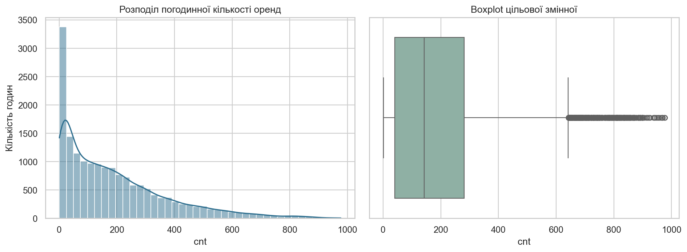
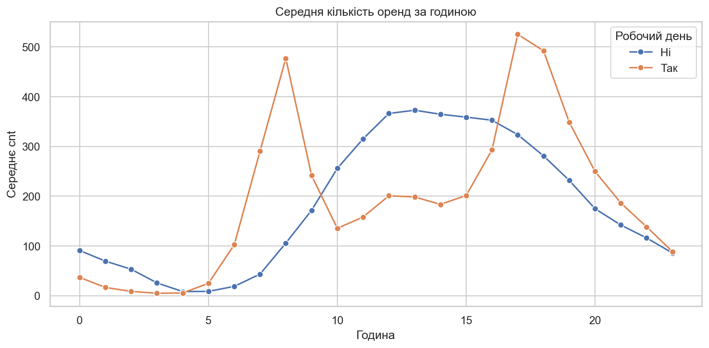
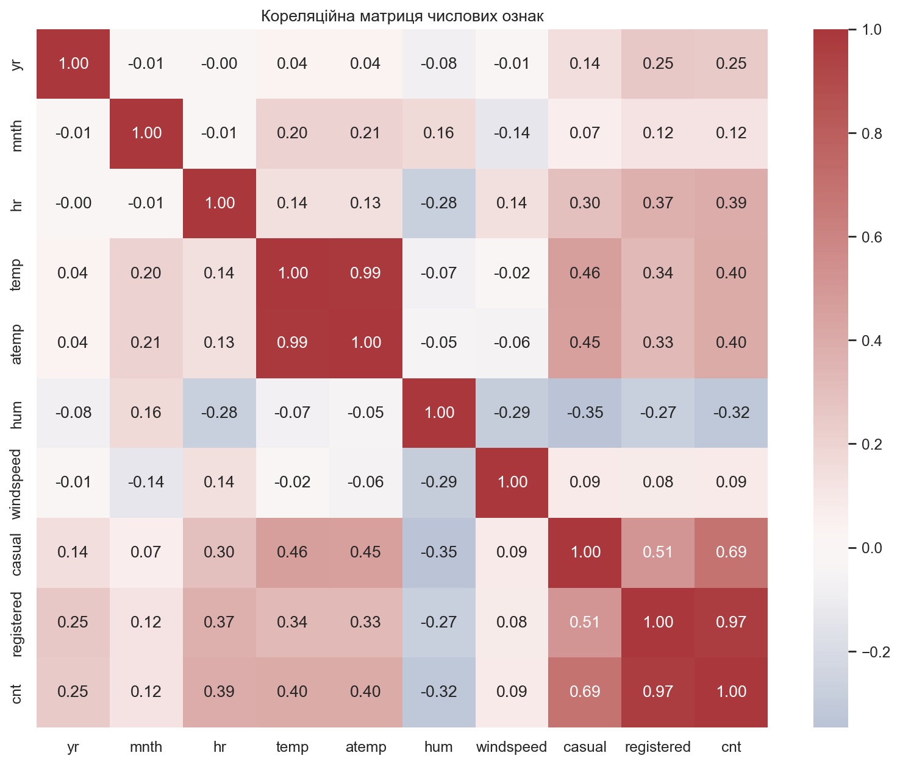
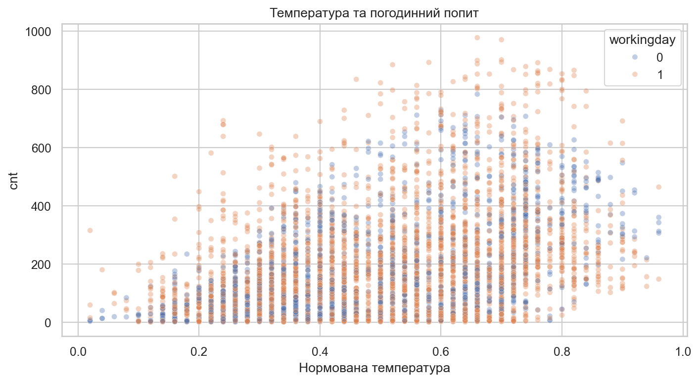

# Практична робота №1

## Тема та мета

Дослідницький аналіз і підготовка Bike Sharing Dataset. Мета — встановити структуру та якість даних, знайти змістовні закономірності, сформулювати перевірювані гіпотези й побудувати preprocessing pipeline для лабораторної роботи №1.

## Постановка задачі

Дані описують погодинну кількість оренд велосипедів Capital Bikeshare у 2011–2012 роках. Рядок відповідає одній годині. Майбутня задача — регресія для прогнозування `cnt`. Такий прогноз може допомагати планувати доступність велосипедів і перерозподіл парку.

## Опис та аудит даних

| Характеристика | Результат |
|---|---:|
| Спостереження | 17 379 |
| Стовпці | 17 |
| Пропущені значення | 0 |
| Повні дублікати | 0 |
| Діапазон `cnt` | 1–977 |
| Медіана `cnt` | 142 |
| Середнє `cnt` | 189,46 |
| Асиметрія `cnt` | 1,277 |
| IQR-викиди `cnt` | 505 |

`season`, `mnth`, `hr`, `holiday`, `weekday`, `workingday`, `weathersit` є категоріальними за змістом, хоча збережені числами. `temp`, `atemp`, `hum`, `windspeed` — неперервні нормовані показники. `yr` використовується як числовий часовий тренд.

## Основні спостереження

- Розподіл `cnt` має праву асиметрію. Великі значення відповідають реальним піковим годинам, тому автоматично їх не видалено.
- Попит має виразний добовий профіль із піками в години поїздок на роботу та з роботи.
- Гірші погодні умови пов’язані зі зниженням оренд. Категорія `weathersit=4` має лише 3 спостереження й буде об’єднана one-hot кодуванням із захистом від невідомих категорій.
- `temp` і `atemp` мають кореляцію 0,988. Обидві залишено: вони мають різний фізичний зміст, а регуляризована модель обмежує нестабільність коефіцієнтів.
- `casual` та `registered` утворюють точну суму `cnt`, тому вилучені як прямий витік цілі.

## План і реалізація preprocessing

| Ознака або проблема | Рішення | Обґрунтування |
|---|---|---|
| `instant` | вилучити | технічний ідентифікатор |
| `dteday` | вилучити з моделі | інформація представлена `yr`, `mnth`, `weekday`, `hr` |
| `casual`, `registered` | вилучити | точний витік `cnt` |
| числові ознаки | медіанна імпутація + `StandardScaler` | стабільна єдина процедура; параметри навчаються лише на train |
| категоріальні ознаки | імпутація модою + `OneHotEncoder` | числа є кодами категорій, а не відстанями |
| IQR-викиди | залишити | це реальні піки попиту, не підтверджені помилки |
| поділ даних | перші 80% train, останні 20% test | поважає часовий порядок і моделює прогноз майбутнього |

Пайплайн навчається лише на навчальній частині. Після перетворення утворюється 60 ознак; неочікуваних пропусків немає. Один і той самий fitted preprocessor застосовується до train і test.

## Робочі гіпотези

1. Година та статус робочого дня взаємодіють: у робочі дні попит має піки приблизно о 8:00 і 17:00–18:00.
2. Суворіші погодні умови та вища вологість пов’язані зі зменшенням `cnt`.
3. Зв’язок температури з орендами нелінійний: попит зростає до комфортного діапазону, але не обов’язково на екстремальній спеці.
4. У 2012 році рівень попиту вищий, тому `yr` є важливим трендовим предиктором.
5. `temp` і `atemp` частково дублюють інформацію; регуляризація може бути кориснішою за нестабільну звичайну лінійну регресію.

## Висновки

Набір чистий за формальними критеріями, але містить дві критичні витокові ознаки та сильну залежність від часу. Найцікавіші закономірності стосуються години, робочого дня, року, температури й погоди. IQR-викиди `cnt` залишено, бо вони описують реальні піки. Для лабораторної роботи потрібно перевірити нелінійність, взаємодію години з календарними ознаками, користь регуляризації та здатність моделі переноситися на пізніший часовий період.

Повний код, таблиці та проміжні результати містяться у [виконаному ноутбуці](notebook/practical01.ipynb).
