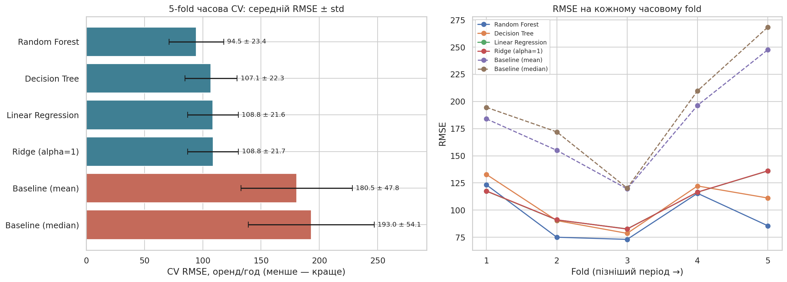
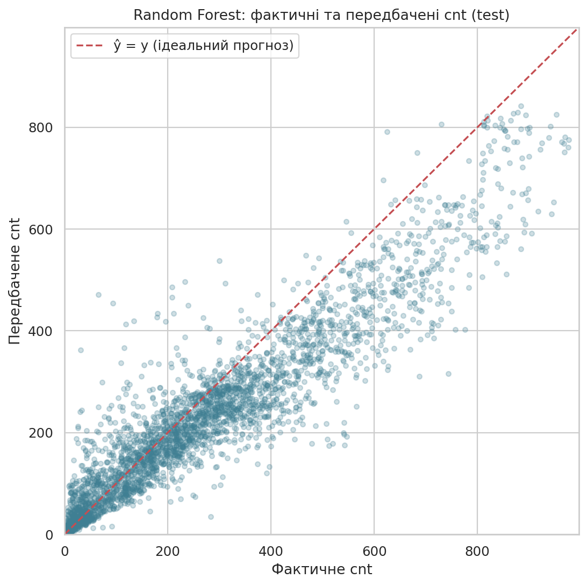
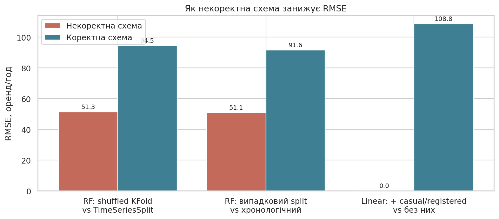

# Практична робота №2

## Тема та мета

Побудова та оцінювання коректного ML-експерименту для задачі регресії. Мета — розділити дані на train/test, побудувати baseline, порівняти кілька регресійних моделей за однаковою 5-fold крос-валідацією, вибрати модель без використання test, один раз оцінити її на test і перевірити схему на data leakage.

## Постановка задачі

Набір той самий, що в ПР1 і ЛР1: погодинний Bike Sharing Dataset (`data/hour.csv`, 17 379 годин 2011–2012 рр.).

- **Об'єкт:** одна година роботи системи прокату.
- **Ознаки:** `season`, `yr`, `mnth`, `hr`, `holiday`, `weekday`, `workingday`, `weathersit`, `temp`, `atemp`, `hum`, `windspeed`.
- **Ціль:** `cnt` — кількість оренд за годину (регресія).
- **Гіпотеза:** ML-моделі дають суттєво менший RMSE, ніж константний прогноз, і ця перевага зберігається на пізнішому періоді.
- **Основна метрика:** RMSE — в одиницях цілі та сильніше штрафує великі промахи в години пік. MAE і R² — додаткові.

## План експерименту

| Елемент | Рішення |
|---|---|
| Train/test | хронологічно: перші 80% (13 903 год, до 2012-08-07) / останні 20% (3 476 год) |
| Preprocessing | `ColumnTransformer` з ПР1 (медіана + `StandardScaler`, мода + `OneHotEncoder`) усередині `Pipeline` |
| Валідація | `TimeSeriesSplit(n_splits=5)`, однакові fold-и для всіх моделей |
| Baseline | `DummyRegressor(mean)`, додатково `median` |
| Кандидати | `LinearRegression`, `Ridge(alpha=1)`, `DecisionTreeRegressor(min_samples_leaf=10)`, `RandomForestRegressor(150 дерев, min_samples_leaf=3, max_features=0.5)` |
| Вибір | мінімальний середній CV RMSE з урахуванням std і парного порівняння по fold-ах |
| Test | один раз після вибору |

Методичка наводить `KFold(shuffle=True)`, але дані часові: перемішування дозволяє вчитися на майбутньому. Тому використано `TimeSeriesSplit`, а наслідок неправильного вибору показано окремо (розділ «Коректність»).

## Реалізація

- `notebook/practical02.ipynb` — увесь експеримент із виводами.
- `../src/bike_workflow.py` — спільне завантаження, хронологічний поділ і preprocessing (з ПР1/ЛР1).
- `results/` — CSV з усіма числами звіту; `figures/` — рисунки.

## Результати крос-валідації

| Модель | CV RMSE | Std RMSE | CV MAE | CV R² | Train RMSE |
|---|---:|---:|---:|---:|---:|
| **Random Forest** | **94,53** | 23,36 | **67,37** | **0,627** | 26,76 |
| Decision Tree | 107,06 | 22,34 | 74,07 | 0,539 | 41,68 |
| Linear Regression | 108,76 | 21,64 | 80,49 | 0,545 | 69,14 |
| Ridge (alpha=1) | 108,83 | 21,71 | 80,58 | 0,545 | 69,14 |
| Baseline (mean) | 180,48 | 47,76 | 138,08 | −0,212 | 123,28 |
| Baseline (median) | 192,99 | 54,07 | 144,24 | −0,379 | 127,77 |

Std обчислено з `ddof=1`, як у формулі методички.

RMSE по fold-ах (`results/cv_fold_rmse.csv`):

| Модель | 1 | 2 | 3 | 4 | 5 |
|---|---:|---:|---:|---:|---:|
| Random Forest | 123,3 | 75,1 | 73,1 | 115,5 | 85,6 |
| Decision Tree | 132,9 | 90,4 | 78,7 | 122,2 | 111,2 |
| Linear Regression | 117,5 | 91,0 | 82,8 | 116,5 | 136,1 |
| Baseline (mean) | 183,9 | 155,0 | 119,5 | 196,4 | 247,6 |

## Аналіз результатів

- Усі ML-моделі перевищили baseline на ~40–48%. Медіанний baseline гірший за середній: за правої асиметрії `cnt` він занижує години пік.
- `Ridge(alpha=1)` ≈ `LinearRegression`: при 13,9 тис. об'єктів і 60 ознаках такий штраф майже не змінює коефіцієнти.
- Одне дерево за середнім близьке до лінійної моделі, але нестабільне між періодами (найгірше на fold 1, краще на fold 5).
- Random Forest має найменший CV RMSE, кращий за лінійну модель у 4 з 5 fold-ів (у fold 1 train — лише перші 3,5 міс. 2011 р.) і кращий за дерево в усіх 5. Середня парна перевага над Linear ≈ 14,2 RMSE.
- Великий std у всіх моделей пояснюється тим, що fold-и — різні сезони з різним рівнем попиту, тому різниця середніх 14 RMSE сама по собі не переконлива; переконливою її робить парне порівняння на тих самих fold-ах.

**Обрана модель (до test): Random Forest.**

## Фінальна оцінка на test

| Модель | MAE | RMSE | R² |
|---|---:|---:|---:|
| Baseline (mean) | 174,99 | 232,61 | −0,113 |
| **Random Forest** | **61,63** | **91,64** | **0,827** |

CV RMSE = 94,53 ± 23,36, test RMSE = 91,64: значення близькі, CV не була оптимістичною.

Точки групуються вздовж `ŷ = y`, але при високому попиті модель систематично занижує прогноз: середня похибка −87 для `cnt` 300–500 і −156 для `cnt > 500`. Ліс не екстраполює за межі значень train, а test-період має вищий середній попит (248,8 проти 174,6 у train).

## Коректність експерименту

Ті самі моделі прогнано за некоректними схемами (для вибору не використовувались):

| Некоректна схема | RMSE | Коректна оцінка |
|---|---:|---:|
| RF, `KFold(shuffle=True)` замість `TimeSeriesSplit` | 51,32 | 94,53 |
| RF, випадковий `train_test_split` замість хронологічного | 51,07 | 91,64 |
| Linear + `casual`, `registered` | 0,00 | 108,76 |

| Перевірка | Результат |
|---|---|
| Test відокремлено до вибору моделі | так |
| Test використовувався для налаштування | ні, гіперпараметри фіксовані наперед |
| Preprocessing навчався лише на train | так, перевірено середні `StandardScaler` |
| Однакові fold-и для всіх моделей | так |
| Baseline за тією ж схемою | так |
| Числа звіту = виводу коду | так, `results/*.csv` |

Обмеження: той самий test-період використовувався в ЛР1, тому він не повністю «свіжий».

## Висновки

1. Гіпотезу підтверджено: найкраща модель зменшила RMSE відносно baseline на 47,6% у CV і з 232,6 до 91,6 на test.
2. За однакових умов обрано Random Forest: CV RMSE 94,53 ± 23,36; на test MAE 61,63, RMSE 91,64, R² 0,827.
3. CV і test узгоджуються (різниця −2,9 при std 23,4).
4. Перемішаний KFold і випадковий split занижують RMSE майже вдвічі, а `casual/registered` дають фіктивний RMSE ≈ 0 — для цього набору коректність схеми важливіша за вибір алгоритму.
5. Обмеження моделі: недооцінка піків у період зростання попиту. У ЛР1 HistGradientBoosting на тих самих fold-ах мав CV RMSE 77,3, тож для практичного прогнозу він лишається кращим; RF — сильніша альтернатива лінійним моделям.
