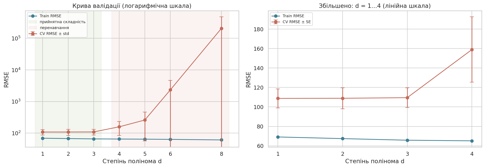
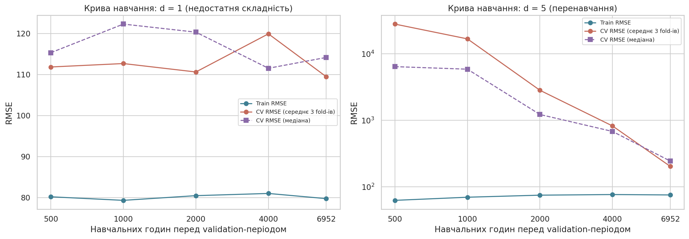
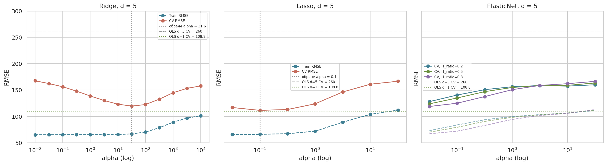
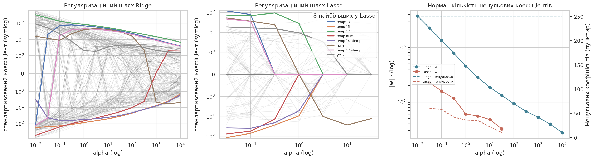

# Практична робота №3

## Тема та мета

Перенавчання, складність моделі та регуляризація. Мета — експериментально виявити недонавчання і перенавчання, дослідити залежність узагальнення від складності, застосувати L1, L2 та Elastic Net, вибрати силу регуляризації без test, перевірити стійкість вибору й обґрунтувати фінальну модель.

## Постановка задачі

Той самий набір, що в ЛР1 і ПР2: Bike Sharing (`data/hour.csv`), ціль `cnt` — кількість оренд за годину (регресія). Раніше прийняті рішення не повторюються: хронологічний split 80/20 (train 13 903 год, test 3 476 год), `TimeSeriesSplit(5)`, preprocessing у `Pipeline`, метрика RMSE. Складність керується степенем полінома `d` для 5 числових ознак (`yr`, `temp`, `atemp`, `hum`, `windspeed`); 7 категоріальних ознак кодуються one-hot (55 стовпців) і в поліном не входять — інакше вже d=2 дало б 1 890 добутків взаємовиключних індикаторів.

## Гіпотези

| № | Гіпотеза | Критерій | Результат |
|---|---|---|---|
| H1 | train RMSE не зростає зі зростанням `d` | монотонне спадання | **підтверджено**: 69,14 → 61,06 |
| H2 | після певного `d` CV RMSE і розрив `G` зростають | мінімум CV, далі ріст | **підтверджено**: мінімум при d=1–3, з d=4 різкий ріст |
| H3 | регуляризація на перенавченому просторі зменшить CV RMSE, `G` і норму коефіцієнтів (≥ 20%) | порівняння з OLS d=5 | **підтверджено**: CV 260 → 111, `G` 196 → 45, ‖w‖₂ 1,6·10⁷ → 158 |
| H4 | надмірна регуляризація → недонавчання | train і CV ростуть разом | **підтверджено** для всіх трьох штрафів |
| H5 | регуляризований складний поліном не дасть переваги над простою моделлю | різниця < 1 SE | **підтверджено**: найкращий Lasso d=5 (111,36) гірший за OLS d=1 (108,76) |

## Експериментальний протокол

| Елемент | Значення |
|---|---|
| Шкала складності | `d ∈ {1, 2, 3, 4, 5, 6, 8}`, OLS |
| Регуляризація | простір d=5; Ridge `alpha ∈ logspace(−2, 4, 13)`; Lasso `alpha ∈ logspace(−1.5, 1.5, 7)`; ElasticNet ті самі `alpha` × `l1_ratio ∈ {0.2, 0.5, 0.8}` |
| Pipeline | `PolynomialFeatures(d)` → `StandardScaler` для числових, `OneHotEncoder` для категоріальних → модель |
| Бюджет | 49 конфігурацій основного пошуку + 5 схем CV для стійкості |
| Правило вибору | мінімальний CV RMSE; серед моделей у межах `RMSE_min + SE_min` — найпростіша |
| Lasso/EN | `max_iter=20000`, `tol=1e-3`; попереджень про незбіжність — 0 |

## Реалізація

- `notebook/practical03.ipynb` — усі експерименти.
- `results/` — таблиці складності, кривих навчання, пошуку регуляризації, шляхів коефіцієнтів, стійкості, фінального порівняння і test.
- `figures/` — криві валідації і навчання, вплив `alpha`, регуляризаційні шляхи.

## Результати: складність

| d | Поліном. ознак | Усього ознак | Train RMSE | CV RMSE | CV std | G = CV − train |
|---:|---:|---:|---:|---:|---:|---:|
| 1 | 5 | 60 | 69,14 | **108,76** | 21,64 | 39,62 |
| 2 | 20 | 75 | 67,43 | 108,90 | 24,11 | 41,46 |
| 3 | 55 | 110 | 65,79 | 109,52 | 22,62 | 43,72 |
| 4 | 125 | 180 | 65,15 | 158,97 | 75,00 | 93,81 |
| 5 | 251 | 306 | 64,54 | 260,16 | 203,01 | 195,63 |
| 6 | 461 | 516 | 63,62 | 2 337,20 | 2 355,38 | 2 273,58 |
| 8 | 1 286 | 1 341 | 61,06 | 205 895 | 269 036 | 205 834 |

Кількість поліноміальних ознак `C(p+d, d) − 1` перевірено проти `PolynomialFeatures` (для d=3: 55 = 55).

- **Недонавчання** вже при d=1: train ≈ 69 і CV ≈ 109 обидва високі (HistGradientBoosting у ЛР1 мав CV ≈ 77). Але степінь полінома тут не допомагає: d=2–3 дають 108,9 і 109,5, бо головна нелінійність — у взаємодії `hr × workingday`, а не в кривизні погоди.
- **Перенавчання** з d=4: CV і `G` стрімко зростають, train продовжує падати. Катастрофічні похибки виникають на fold-ах 1 і 4, де validation-період (весна–літо) має температуру й вологість поза діапазоном train цього fold-а: поліном високого степеня **екстраполює** і «вибухає». Fold 3 (осінь–зима, діапазон уже покритий) стабільний для всіх `d`.

## Криві навчання

Для трьох останніх часових fold-ів модель навчалась на `n` найближчих попередніх годинах (стандартний `learning_curve` з `TimeSeriesSplit` обмежений найменшим fold-ом у 2 318 год).

| d | n = 500 | 1 000 | 2 000 | 4 000 | 6 952 |
|---|---:|---:|---:|---:|---:|
| 1: train / CV | 80,2 / 111,8 | 79,3 / 112,7 | 80,5 / 110,6 | 81,0 / 119,9 | 79,7 / 109,5 |
| 5: train / CV | 62,5 / 27 880 | 69,6 / 16 712 | 74,7 / 2 819 | 76,4 / 821 | 75,3 / 202 |

- **d=1** — плоскі криві з високою похибкою: високе зміщення, більше даних не допоможе.
- **d=5** — CV падає на два порядки з ростом історії (ширший діапазон погоди → менше екстраполяції), але навіть на 6 952 год удвічі гірший за d=1: висока дисперсія.

## Результати: регуляризація (d = 5)

| Модель | alpha | l1_ratio | Train RMSE | CV RMSE | CV SE | G | ‖w‖₂ | Ненульових з 251 |
|---|---:|---:|---:|---:|---:|---:|---:|---:|
| OLS | — | — | 64,54 | 260,16 | 90,79 | 195,63 | 15 602 672 | 251 |
| Ridge | 31,6 | — | 66,64 | 119,53 | 15,94 | 52,89 | 132,0 | 251 |
| **Lasso** | 0,1 | — | 65,93 | **111,36** | 12,74 | 45,43 | 158,3 | **58** |
| ElasticNet | 0,0316 | 0,8 | 66,98 | 118,76 | 15,67 | 51,77 | 89,2 | 165 |

- За дуже малих `alpha` CV залишається високим (перенавчання), у центрі — мінімум, за великих `alpha` train і CV ростуть разом (недонавчання). Для Ridge і Lasso оптимум усередині сітки. Для ElasticNet найкраще `alpha = 0,0316` лежить на **нижній межі** сітки: зі зменшенням `alpha` модель наближається до Lasso/OLS з малим штрафом. Сітку не розширювали після перегляду результатів (обмеження бюджету); оскільки ElasticNet у всіх точках гірший за Lasso, висновок про вибір від цього не залежить.
- `yr` бінарна, тому `yr^2 = yr`, `yr^3 = yr` тощо — поліном створює точні дублікати стовпців. Це ще одна причина нестабільності OLS-коефіцієнтів (матриця вироджена) і причина, чому Lasso залишає лише одного представника групи.
- Норма коефіцієнтів OLS ≈ 1,6·10⁷: величезні протилежні коефіцієнти корельованих степенів компенсують один одного на train і «вибухають» поза ним. Регуляризація зменшує норму на 5 порядків.
- Ridge стискає всі 251 коефіцієнт, але жодного не обнуляє; Lasso при `alpha=0,1` залишає 58, при `alpha=31,6` — 10.

## Стійкість

Вибір `alpha` повторено для `TimeSeriesSplit(n_splits = 4…8)`:

| Модель | Діапазон alpha | CV RMSE (середнє ± SD між схемами) | ‖w‖₂ | Ненульових | Jaccard множин ненульових |
|---|---|---:|---|---|---:|
| Ridge | 10 – 100 | 123,95 ± 12,42 | 92,9 – 185,9 | 251 | 1,00 |
| Lasso | 0,1 – 0,316 | 112,96 ± 8,40 | 117,4 – 158,3 | 42 – 58 | 0,81 |
| ElasticNet | 0,0316 – 0,1 | 120,46 ± 9,43 | 63,4 – 89,2 | 155 – 165 | 0,87 |

Стабільна величина — порядок `alpha` (у межах одного десяткового порядку) і перевага Lasso над Ridge в усіх п'яти схемах. Нестабільний — точний набір ненульових коефіцієнтів Lasso (Jaccard 0,81): корельовані степені однієї змінної взаємозамінні, тому обнулення не є рейтингом важливості.

## Вибір фінальної моделі

| Модель | Ознак | CV RMSE | CV SE | G | ≤ RMSE_min + SE (118,44) |
|---|---:|---:|---:|---:|:---:|
| **OLS d=1** | 60 | **108,76** | 9,68 | 39,62 | ✓ |
| OLS d=2 | 75 | 108,90 | 10,78 | 41,46 | ✓ |
| OLS d=3 | 110 | 109,52 | 10,12 | 43,72 | ✓ |
| Lasso d=5, alpha=0,1 | 306 | 111,36 | 12,74 | 45,43 | ✓ |
| ElasticNet d=5 | 306 | 118,76 | 15,67 | 51,77 | — |
| Ridge d=5, alpha=31,6 | 306 | 119,53 | 15,94 | 52,89 | — |
| OLS d=4…8 | 180–1 341 | 159 – 205 895 | — | — | — |

За мінімальним CV RMSE і за правилом однієї SE обрано **OLS d=1**: найменша похибка й найпростіша модель. Регуляризація приборкала перенавчений простір, але не дала відтворюваної переваги, тож 306 ознак замість 60 не виправдані. Вимога інтерпретованості веде до того самого рішення.

## Фінальне оцінювання

| Модель | MAE | RMSE | R² |
|---|---:|---:|---:|
| **OLS d=1 (обрана)** | 98,80 | 133,84 | 0,632 |
| OLS d=5 (контроль) | 954,63 | 15 188,91 | −4 744,7 |
| Ridge d=5, alpha=31,6 (контроль) | 95,60 | 130,09 | 0,652 |

Контрольні моделі зафіксовано наперед і оцінено один раз лише для ілюстрації, вибір після цього не змінювався. Нерегуляризований поліном d=5 на test повністю непридатний (R² ≈ −4 745) — test-період (осінь–зима 2012) знову містить комбінації погоди, яких не було в train. Ridge d=5 на test трохи кращий за обрану модель (130,1 проти 133,8), але різниця менша за CV SE (≈ 10–16) і протилежна CV-результату, тож вона не є підставою змінювати рішення. Test RMSE обраної моделі вищий за CV (133,8 проти 108,8): test-період має вищий рівень попиту (див. ПР2), а лінійна модель не відтворює зростання піків. Обмеження: цей test уже використовувався в ЛР1/ПР2, тому не є повністю незалежним.

## Аудит рекомендацій ШІ

| Твердження ШІ | Спосіб перевірки | Фактичний результат | Рішення |
|---|---|---|---|
| «Збільшення степеня полінома покращить прогноз, бо залежність від погоди нелінійна» | крива валідації для 7 степенів на однакових fold-ах | train RMSE падає, але CV з d=4 росте до 159…205 895 | **відхилено** |
| «Можна застосувати `PolynomialFeatures(degree=3)` до всіх ознак» (як у чорновому `main.py`) | аналітично: `C(60+3, 3) − 1 = 39 710` стовпців, більшість — добутки взаємовиключних one-hot | неконтрольоване зростання ознак без змісту; методичка це забороняє | **змінено**: поліном лише по 5 числових ознаках |
| «Ridge усуне перенавчання d=5 і дасть кращу модель» | CV RMSE, `G`, норма, порівняння з d=1 | CV 260 → 119,5, `G` 196 → 53 — перенавчання усунуто; але 119,5 > 108,8 (d=1) | **змінено**: прийнято першу частину, відхилено другу |
| «Нульові коефіцієнти Lasso показують неважливі ознаки» | множини ненульових на 5 схемах CV | Jaccard 0,81, кількість 42–58 — набір залежить від fold-ів | **змінено**: це властивість конкретного розв'язку, а не важливість |
| «`learning_curve` з `TimeSeriesSplit` дасть криву навчання для всього train» | перевірка `train_sizes_abs` | розміри обмежені найменшим fold-ом (2 318 год), береться лише початок 2011 р. | **відхилено**: крива побудована вручну на найближчій історії |

Друге твердження перевірено незалежним аналітичним розрахунком, а не лише запуском коду.

## Висновки

1. Перевірено п'ять гіпотез; усі підтвердились (див. таблицю гіпотез).
2. Недонавчання — при d = 1–3 (train ≈ 66–69, CV ≈ 109, плоскі криві навчання); воно не усувається степенем полінома.
3. Перенавчання починається з d = 4: CV 159, `G` 94; при d = 6 — CV 2 337, при d = 8 — понад 2·10⁵. Механізм — екстраполяція полінома в нові діапазони погоди.
4. Розрив узагальнення зростав від 40 (d=1) до 196 (d=5) і 2,1·10⁵ (d=8).
5. Більше даних допомагає складній моделі (CV d=5: 27 880 → 202), але не простій (≈ 110 незалежно від n).
6. Найдоцільніший штраф — Lasso (`alpha = 0,1`): CV 111,36, 58 ненульових коефіцієнтів із 251; Ridge і ElasticNet — 119,5 і 118,8.
7. Регуляризація зменшила ‖w‖₂ з 1,6·10⁷ до 89–158, але вибір конкретних ненульових коефіцієнтів Lasso нестабільний (Jaccard 0,81).
8. Оптимальне `alpha` стабільне в межах одного порядку: Ridge 10–100, Lasso 0,1–0,316, ElasticNet 0,03–0,1.
9. Складна регуляризована модель не дала переваги над OLS d=1 (111,36 проти 108,76).
10. Test RMSE обраної моделі 133,84 (R² 0,632) — вищий за CV через зростання попиту в test-періоді; нерегуляризований d=5 на test непридатний (RMSE 15 189).
11. Інженерне рішення: OLS d=1 як найпростіша модель із найменшим CV RMSE. Для реального покращення потрібні не поліноми погоди, а взаємодії календарних ознак або нелінійні моделі (HistGradientBoosting з ЛР1).
