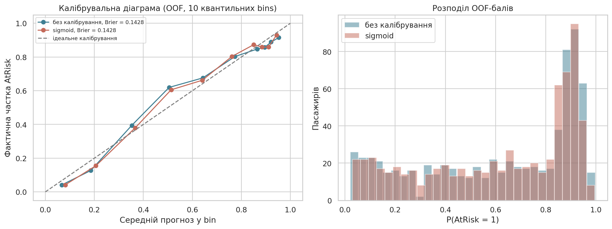
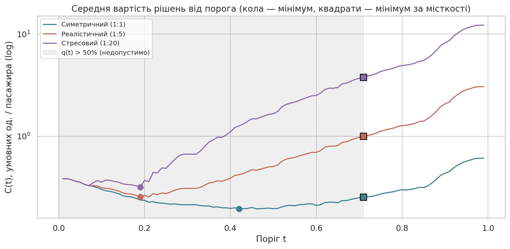
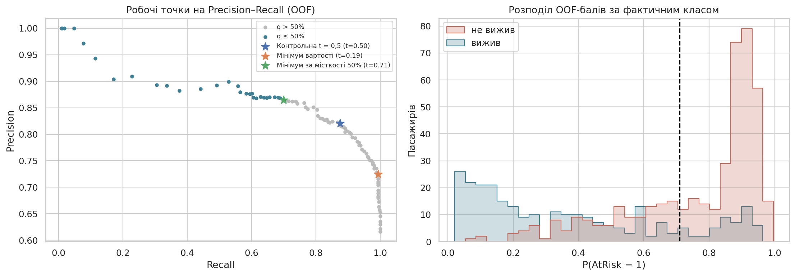
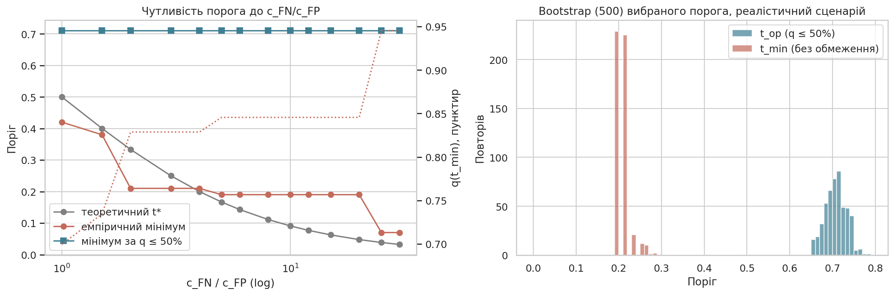
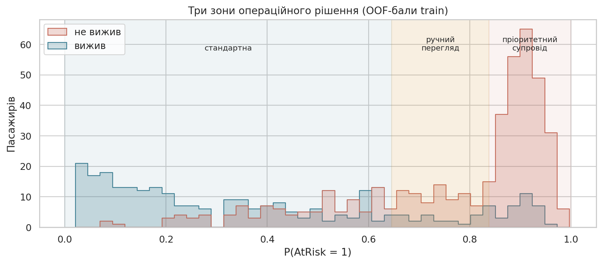

# Практична робота №4

## Тема та мета

Пороги, вартість помилок і прийняття рішень у класифікації. Мета — перетворити прогнозний бал зафіксованого класифікатора на обґрунтоване операційне рішення з урахуванням різної вартості FP/FN, ресурсного обмеження і калібрування; вибрати робочу точку без test; реалізувати політику як тестований компонент.

## Контекст рішення

Набір, ціль і модель — з ЛР2: Titanic, `AtRisk = 1` (не вижив), логістична регресія з preprocessing `src/titanic_workflow.py`. **Навчальний сценарій:** під час евакуації судна екіпаж може персонально супроводити до шлюпок лише частину пасажирів; модель за реєстраційними даними оцінює ризик загибелі. Історичні дані використовуються як модель ситуації, числа не є оцінкою реальної системи.

| Питання | Відповідь |
|---|---|
| `y = 1` / `y = 0` | не вижив / вижив |
| Дія за `ŷ = 1` | пасажир у списку **пріоритетного супроводу** членом екіпажу |
| Дія за `ŷ = 0` | стандартна евакуація |
| Виконавець | черговий офіцер формує список, члени екіпажу супроводжують |
| Доступність ознак | з моменту посадки (клас, стать, вік, родина, тариф, порт) |
| Правильна мітка | лише після події; для моніторингу — з великою затримкою |

- **FP** — супровід отримав пасажир, який упорався б сам: витрачено час члена екіпажу, якого бракуватиме іншим (одиниця — «зайвий супровід»).
- **FN** — пасажир із реальним ризиком без пріоритетної допомоги; наслідок — потенційна загибель. Грошима не вимірюється, тому використовується лише сценарне відношення `c_FN / c_FP`.

## Протокол

| Елемент | Значення |
|---|---|
| Split | стратифікований 80/20, `random_state=42` (train 712, test 179) |
| Модель | `LogisticRegression(max_iter=1000)` у `Pipeline`, нових алгоритмів не шукали |
| Бал | `predict_proba[:, 1]` |
| OOF | `StratifiedKFold(5, shuffle=True, random_state=42)`; кожен об'єкт має рівно один прогноз (`results/oof_scores.csv`: `object_id, y_true, score_raw, score_calibrated, fold`) |
| Калібрування | `CalibratedClassifierCV(method="sigmoid", cv=3)` усередині кожного зовнішнього fold-а |
| Сітка порогів | 0,01…0,99 з кроком 0,01 (99 значень) |
| Ресурсне обмеження | супровід не більше ніж для **50%** пасажирів, `q(t) ≤ 0,50` (припущення сценарію, м'який орієнтир) |

## Реалізація

- `notebook/practical04.ipynb` — увесь аналіз.
- `src/decision_policy.py` — клас `DecisionPolicy` (два пороги, правило `score >= threshold`, три дії) і функція `top_k_decisions` для жорсткої квоти.
- `configs/policy_config.json` — версіонована конфігурація політики (генерується notebook).
- `tests/test_decision_policy.py` — 18 модульних тестів.
- `results/` — OOF-бали, сітка порогів, сценарії, чутливість, bootstrap, три зони, фінальні рішення на test.

Запуск тестів:

```bash
cd practical04
python -m unittest -v tests/test_decision_policy.py
```

Результат: `Ran 18 tests ... OK`.

## Калібрування

| Варіант (OOF) | ROC-AUC | Brier score | Середній бал | Частка y=1 |
|---|---:|---:|---:|---:|
| Логістична регресія | 0,8530 | 0,1428 | 0,616 | 0,617 |
| Після sigmoid-калібрування | 0,8527 | 0,1428 | 0,616 | 0,617 |



Логістична регресія вже добре калібрована (вона мінімізує log-loss): середній бал дорівнює частці позитивного класу, відхилення по децилях у межах ±0,06, крім одного bin-а (0,42–0,58), де ризик **недооцінено** на 0,115 — це переважно жінки 3-го класу і чоловіки 1-го класу з ЛР2. У верхніх децилях (p > 0,84) ризик трохи переоцінено (−0,02…−0,04). Sigmoid-калібрування нічого не покращило (Brier однаковий до 4 знаків), тому подальші розрахунки використовують некалібровані бали — без зайвого компонента.

## Контрольна політика t = 0,5 (OOF)

TP 384, FP 84, FN 55, TN 189; Precision 0,821, Recall 0,875, F1 0,847; **q = 65,7%** (657 супроводів на 1 000 пасажирів) — вже перевищує місткість 50%.

## Матриця вартостей і сценарії

| Факт \ рішення | Стандартна евакуація | Пріоритетний супровід |
|---|---|---|
| Вижив | TN — наслідків немає, 0 | FP — зайвий супровід, `c_FP` |
| Не вижив | FN — людина з ризиком без допомоги, `c_FN` | TP — бажана дія, 0 |

Вартості — **сценарні** припущення (не фактичні, не нормативні); ШІ не є джерелом реальної ціни помилки.

| Сценарій | c_FP | c_FN | t* | t_min | q(t_min) | Recall(t_min) | t_op (q ≤ 50%) | q(t_op) | Recall(t_op) | Precision(t_op) |
|---|---:|---:|---:|---:|---:|---:|---:|---:|---:|---:|
| Симетричний | 1 | 1 | 0,500 | 0,42 | 69,9% | 0,909 | 0,71 | 49,9% | 0,699 | 0,865 |
| **Реалістичний** | 1 | 5 | 0,167 | 0,19 | 84,6% | 0,993 | **0,71** | 49,9% | 0,699 | 0,865 |
| Стресовий | 1 | 20 | 0,048 | 0,19 | 84,6% | 0,993 | 0,71 | 49,9% | 0,699 | 0,865 |



- Емпіричні мінімуми близькі до теоретичних `t*` (0,42 проти 0,50; 0,19 проти 0,167), але не збігаються: скінченна вибірка, дискретна сітка і локальна некаліброваність у середньому діапазоні балів. Для стресового сценарію `t* = 0,048`, а емпіричний мінімум 0,19 — нижче 0,19 майже не лишається FN, які можна «виграти».
- **Жоден** необмежений мінімум не вкладається в місткість: навіть симетричний сценарій вимагає 70% супроводів. Обмеження є зв'язуючим для всіх сценаріїв, тому найкраща допустима точка — найменший поріг із `q ≤ 50%`, тобто **t = 0,71** для всіх трьох сценаріїв. Важливо: частка пасажирів у групі ризику — 61,7%, тож за місткості 50% навіть ідеальна модель знайшла б не більше ~81% з них.

## Кандидатні політики (реалістичний сценарій, OOF)

| Політика | t | TP | FP | FN | TN | Precision | Recall | q | Дій на 1000 | C̄ |
|---|---:|---:|---:|---:|---:|---:|---:|---:|---:|---:|
| Контрольна | 0,50 | 384 | 84 | 55 | 189 | 0,821 | 0,875 | 65,7% | 657 | 0,504 |
| Мінімум вартості | 0,19 | 436 | 166 | 3 | 107 | 0,724 | 0,993 | 84,6% | 846 | 0,254 |
| **Мінімум за місткості 50%** | **0,71** | 307 | 48 | 132 | 225 | 0,865 | 0,699 | 49,9% | 499 | 0,994 |



Поріг 0,71 не має найменшої вартості, але це найкраща точка, яку екіпаж здатен виконати. Вартість зростає саме через ресурс: 132 пасажири з ризиком лишаються поза супроводом.

**Жорстка квота.** Якщо 50% — фізична межа, фіксований поріг її не гарантує (див. test нижче). Тоді застосовується `top_k_decisions`: у кожній партії позначаються рівно `k = ⌊0,5·n⌋` пасажирів із найбільшим балом; ties — за зростанням `PassengerId` (відтворювано); решта — стандартна евакуація з повідомленням офіцеру про переповнення черги.

## Чутливість і стійкість

| c_FN/c_FP | 1 | 1,5 | 2–4 | 5–20 | 25–30 |
|---|---:|---:|---:|---:|---:|
| t_min | 0,42 | 0,38 | 0,21 | 0,19 | 0,07 |
| q(t_min) | 69,9% | 73,5% | 82,9% | 84,6% | 94,5% |
| t_op (q ≤ 50%) | 0,71 | 0,71 | 0,71 | 0,71 | 0,71 |



- Без обмеження зростання ціни FN зменшує поріг і роздуває чергу до 85–95%. З обмеженням поріг сталий: подальше підвищення заявленої ціни FN нічого не змінить, доки не зміниться місткість або якість ранжування.
- Bootstrap (500 повторів OOF): `t_op` — 5/50/95-й процентилі **0,67 / 0,71 / 0,75**; `t_min` — 0,19 / 0,21 / 0,23. Діапазон майже рівноцінних (≤ +1% вартості) порогів без обмеження — 0,19–0,21; з обмеженням оптимум лежить на межі допустимої області, тому рівноцінного діапазону немає — рішення фактично є правилом «верхні 50% за ризиком».

## Політика з ручним переглядом

Верхні 40% за балом — автоматичний супровід, наступні 15% — ручний перегляд черговим офіцером (з урахуванням інформації поза моделлю: діти, мобільність), решта — стандартна евакуація. Пороги з квантилів OOF: `t_low = 0,646`, `t_high = 0,838`.

| Зона | Частка | Середній бал | Фактична частка AtRisk | На 1000 пасажирів |
|---|---:|---:|---:|---:|
| Пріоритетний супровід | 40,0% | 0,909 | 0,877 | 400 |
| Ручний перегляд | 15,0% | 0,740 | 0,804 | 150 |
| Стандартна евакуація | 44,9% | 0,313 | 0,322 | 449 |



| Політика | Автосупровід | Ручний перегляд | AtRisk поза будь-якою увагою |
|---|---:|---:|---:|
| Один поріг t = 0,71 | 49,9% | 0 | 30,1% |
| Три зони | 40,0% | 15,0% | 23,5% |

Фактичний ризик спадає від зони до зони, тож упорядкування коректне. Зона перегляду тут — не «невизначені» випадки, а **наступні в черзі** (ризик 0,80): справжня невизначеність (p ≈ 0,5) потрапляє у стандартну зону, де 32% пасажирів у групі ризику. Ефективність і вартість ручного перегляду невідомі, тому вартісного порівняння не робимо: три зони дають меншу частку пропущених лише ціною додаткових 15% роботи офіцера.

## Конфігурація

`configs/policy_config.json` містить ідентифікатор і версію, семантику бала, правило `score >= threshold`, пороги (`low = high = 0,71` — одно-порогова основна політика), три дії, альтернативні три-зонні пороги, правило top-k, сценарій вартості з позначкою «scenario assumption», місткість, джерело прогнозів, `random_state`, дату, відповідального і умови перегляду. Код читає пороги лише з конфігурації (`DecisionPolicy.from_config`).

Тести перевіряють: бал нижче/рівний/між/вище порогів, значення поза [0, 1] і NaN, неправильний порядок порогів, поріг поза діапазоном, пакет і порядок результатів, одно-порогову політику, узгодженість конфігурації з кодом, а для top-k — порожню партію, партію меншу за k, рівно k, ties і відтворюваність.

## Фінальне оцінювання

Запис рішення до відкриття test: LR без перекалібрування; правило `score >= 0,71`; сценарій `c_FP = 1, c_FN = 5`; м'яка місткість 50%; метрики — confusion matrix, Precision, Recall, частка дій, Brier, вартість; очікуване навантаження ≈ 50%.

| Набір | TN | FP | FN | TP | Precision | Recall | q | Brier | ROC-AUC | C̄ |
|---|---:|---:|---:|---:|---:|---:|---:|---:|---:|---:|
| OOF train | 225 | 48 | 132 | 307 | 0,865 | 0,699 | 49,9% | 0,143 | 0,853 | 0,994 |
| **Test** | 56 | 13 | 27 | 83 | 0,865 | 0,755 | **53,6%** | 0,146 | 0,825 | 0,827 |

Precision і Brier на test такі самі, як на OOF, вартість навіть трохи нижча (0,83 проти 0,99), але **частка дій 53,6% перевищила орієнтир 50%**: поріг, що давав 49,9% на train, не гарантує ту саму частку на новій партії. Якщо 50% — м'який план, це обробляється резервом і моніторингом; якщо жорстка межа — потрібен top-k. Поріг після перегляду test **не змінювався**.

## Інженерний висновок

1. Поріг 0,5 непридатний: він вимагає супроводу 65,7% пасажирів і не враховує ні вартість, ні ресурс.
2. Основний сценарій — реалістичний (`c_FN/c_FP = 5`): пропущений пасажир із ризиком значно гірший, ніж зайвий супровід, але ресурс екіпажу не безкінечний.
3. Робоча точка — **t = 0,71** (Precision 0,865, Recall 0,699, q = 49,9% на OOF).
4. Місткість повністю визначила рішення: без неї оптимум 0,19 з чергою 85%.
5. Модель уже добре калібрована (Brier 0,143), sigmoid не потрібен; локальна недооцінка ризику в діапазоні балів 0,42–0,58.
6. Поріг стійкий: bootstrap 0,67–0,75, незалежний від `c_FN/c_FP` при чинному обмеженні.
7. Три-зонна політика зменшує частку пропущених з 30,1% до 23,5% ціною 15% ручних переглядів; її доцільність залежить від невідомої ефективності перегляду.
8. Test підтвердив якість і вартість, але показав перевищення навантаження (53,6%).
9. Моніторинг: частка дій у кожній партії, розподіл балів, Brier на мітках навчальних тривог, кількість пасажирів поза супроводом.
10. Переглядати політику при зміні місткості екіпажу, відхиленні частки дій за межі 40–60%, зростанні Brier понад 0,16 або перенавчанні моделі.
